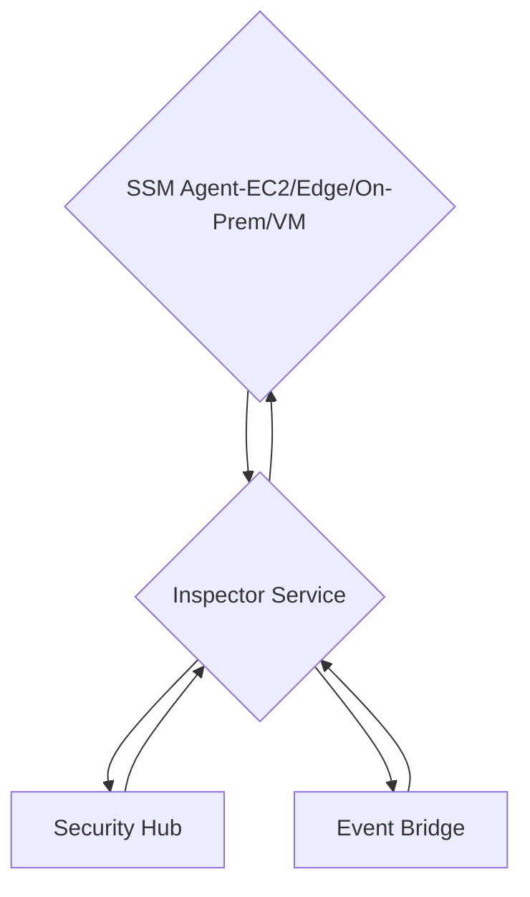
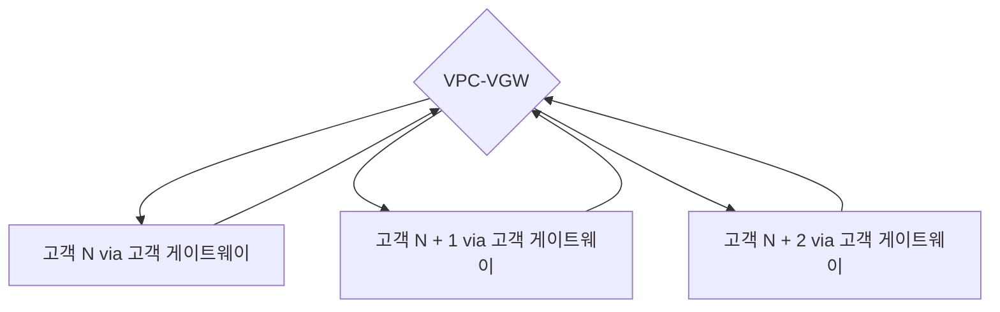
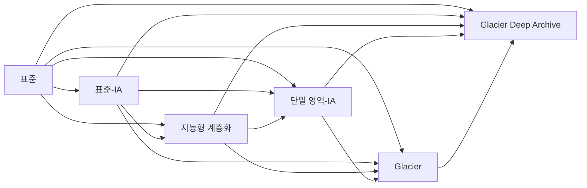
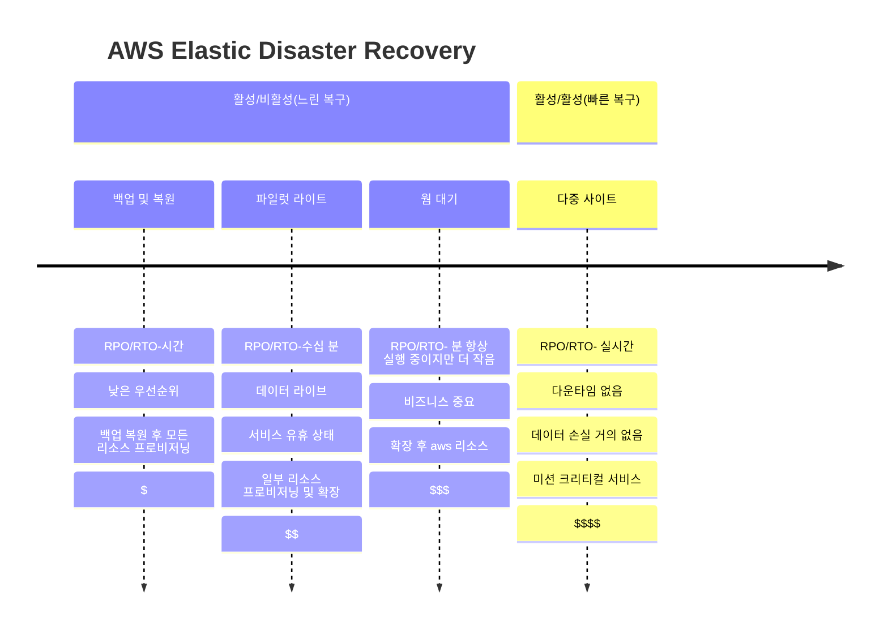
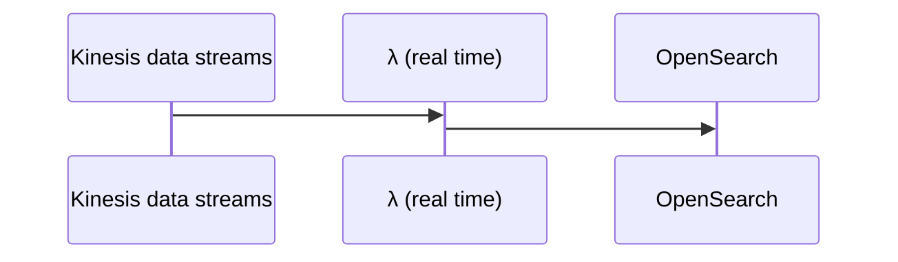

# AWS SAP-CO2 학습 가이드
(forked from LongBu/AWS-SAP-C02-Study-Guide) 다음 가이드는 AWS Certified Solutions Architect Professional 시험에 합격하기 위한 저의 개인적인 학습 노력이며, 가능하면 다른 사람들에게도 도움이 되고자 합니다. Stephane Maarek의 [Ultimate AWS Certified Solutions Architect Professional 2023](https://www.udemy.com/course/aws-solutions-architect-professional/) 강좌를 수강하고 [AWS Certified Solutions Architect Professional Practice Exam](https://www.udemy.com/course/aws-certified-solutions-architect-professional-aws-practice-exams/)에서 몇 가지 모의시험을 치른 후 시험에 응시하는 것을 권장합니다.

참고: 저자는 이 가이드에 대해 어떠한 약속이나 보증도 하지 않으며, 이는 언급한 대로 개인적으로 사용하는 가이드일 뿐입니다. 이 문서는 작업 진행 중이며 아직 시험에 합격하지 않았습니다.

## 목차
1. <a href="#introduction">소개</a>
2. <a href="#organizational-unit-ou">조직 단위(OU)</a>
3. <a href="#identity-and-access-management-iam">ID 및 접근 관리(IAM)</a>
4. <a href="#networking">네트워킹</a>
5. <a href="#ec2">EC2</a>
6. <a href="#containers">컨테이너</a>
7. <a href="#logging-events-and-aws-messaging">로깅, 이벤트 및 AWS 메시징</a>
8. <a href="#configurations-and-security">구성 및 보안</a>
9. <a href="#vpc">VPC</a>
10. <a href="#storage">스토리지</a>
11. <a href="#database">데이터베이스</a>
12. <a href="#analytics">분석</a>
13. <a href="#infrastructure-as-code-iac--platform-as-a-service-paas">인프라 코드(IAC) / 서비스형 플랫폼(PAAS)</a>
14. <a href="#optimization">최적화</a>
15. <a href="#miscellaneous">기타</a>
16. <a href="#acronyms">약어</a>

## 소개
<a href="https://d1.awsstatic.com/training-and-certification/docs-sa-pro/AWS-Certified-Solutions-Architect-Professional_Exam-Guide.pdf">AWS Certified Solutions Architect - Professional (SAP-C02) 시험 가이드</a>

<a href="https://certmetrics.com/amazon/candidate/benefit_summary.aspx">이전에 다른 AWS 시험에 합격했다면 할인 코드를 활용하는 것을 잊지 마세요</a>

### 시험 내용 분류:

| 도메인  | 시험 비율 |
| ------------- | ------------- |
| 도메인 1: 조직 복잡성에 대한 솔루션 설계  | 26%  |
| 도메인 2: 새 솔루션 설계  | 29%  |
| 도메인 3: 기존 솔루션의 지속적 개선 | 25% |
| 도메인 4: 워크로드 마이그레이션 및 현대화 가속 | 20% |
| **총합** | **100%** |

## 조직 단위(OU)

### AWS 계정 조직 단위 마이그레이션:
  * 이전 조직에서 멤버 계정 제거 [해당 멤버 계정과 마스터 계정에 대한 루트 또는 IAM 액세스 필요]
  * 예상 조직에서 멤버 계정으로 초대 보내기
  * 멤버 계정에서 예상 조직의 초대 수락
  * 멤버 계정에 OrganizationAccountAccessRole이 추가되었는지 확인

### AWS Control Tower:
  * 모범 사례를 기반으로 안전하고 규정을 준수하는 다중 계정 AWS 환경을 쉽게 설정하고 관리할 수 있으며 계정을 생성하기 위해 AWS OU를 사용
  * 몇 번의 클릭으로 환경 설정을 자동화
  * 가드레일을 사용한 지속적인 정책 관리 자동화:
    * SCP: 예방적
    * AWS Config: 탐지적
  * 정책 위반을 감지하고 해결
  * 대시보드를 통한 규정 준수 모니터링

### 서비스 제어 정책(SCP):
  * OU의 권한을 관리하여 계정이 제한/가드레일 내에서 유지되도록 하는 정책
  * SCP는 어떤 권한도 부여하지 않으며, IAM, SCP 및 IAM 권한 경계의 교집합이 실제 액세스 권한이 됨
  * OU는 이를 활용하기 위해 모든 기능이 활성화되어야 함
  * 루트 사용자를 포함한 멤버 계정과 그 안의 사용자 및 역할에 영향을 미치지만, 관리 계정에는 영향을 미치지 않음
  * 리소스 기반 정책에 직접적인 영향을 주지 않음
  * AWS OU와 통합되는 다른 AWS 서비스를 위한 서비스 연결 역할에는 영향을 주지 않음
  * 루트 계정에서 비활성화되면 해당 루트 계정 아래의 모든 OU에서 SCP가 자동으로 분리됨. 재활성화하면 모든 계정이 전체 AWS 액세스(기본값)으로 복원됨
  * IAM과 유사하게 명시적 허용이 필요함(기본적으로 아무것도 허용되지 않음) - IAM 권한 경계와 유사함(경계에 없으면 거부)

## ID 및 접근 관리(IAM)

### 허용 vs 거부: 정책에 거부가 있으면 허용 문이 있더라도 리소스가 거부됨. 기본 동작은 리소스를 거부하고, 리소스에 액세스하려면 허용 문이 필요함.

### LDAP: 네트워크에서 조직, 개인 및 기타 리소스에 대한 데이터를 찾기 위한 소프트웨어 프로토콜.

### ID 페더레이션: 사용자 인증 및 리소스 접근 권한 부여에 필요한 정보를 전달하기 위한 두 당사자 간의 신뢰 시스템.

### 사용자 그룹은 사용자만 포함할 수 있음

### S3 버킷 정책 vs 액세스 권한:
  * 버킷의 일부 또는 모든 S3 객체에 대한 권한을 추가하거나 거부하는 데 사용되며, 중앙 집중식 권한 관리를 가능하게 함
  * AWS 계정 내 사용자 또는 다른 AWS 계정에 S3 리소스 접근 권한을 부여할 수 있음
  * 요청 시간(날짜 조건), SSL을 통한 요청 전송(불린 조건), 요청자 IP 주소(IP 주소 조건) 등을 기반으로 제한할 수 있음
  * S3에 대한 사용자 액세스 => IAM 권한
  * 인스턴스(EC2) 액세스 => IAM 역할
  * S3에 대한 공개 액세스 => 버킷 정책

| 액세스 제어 유형 | 계정 수준 제어 | 사용자 수준 제어 |
| ------------- | ------------- | ------------- |
| IAM 정책 | 아니오 | 예 |
| ACL | 예 | 아니오 |
| 버킷 정책 | 예 | 예 |

### IAM 자격 증명 보고서: 모든 AWS 계정, IAM 사용자 및 다양한 자격 증명 상태를 나열하는 IAM 보안 도구; **계정 수준**에서 권한 감사에 유용함

### IAM 액세스 어드바이저: 사용자에게 부여된 서비스 권한과 해당 서비스가 마지막으로 사용된 시기를 보여줌; **사용자 수준**에서 정책을 수정하는 데 이 정보를 사용할 수 있음

### AWS 정책 시뮬레이터: 사용자, 사용자 그룹 또는 리소스에 연결된 IAM 정책을 테스트하고 문제를 해결하는 데 사용됨.

### IAM 액세스 분석기: 조직 및 계정의 리소스(예: Amazon S3 버킷이나 IAM 역할)가 외부 엔터티와 공유되는 의도하지 않은 액세스를 식별하는 서비스로, 보안 위험을 방지함

### IAM 정책 평가 로직:


### Amazon Cognito:
  * 애플리케이션/리소스와 웹 IdP 간의 상호 작용을 처리하는 웹 ID 페더레이션 서비스/ID 브로커
  * SNS를 사용하여 데이터 변경 시 특정 사용자와 연결된 모든 장치에 알림을 보내는 다양한 장치에서 데이터 동기화 가능(IAM 정책을 사용자 ID에 연결 가능)
  * 사용자 풀: 사용자 기반; 사용자 등록, 인증 및 계정 복구 처리
    * 호환 가능한 IdP: Facebook, Amazon, Google, Apple, OpenID Connect 공급자, SAML
  * 자격 증명 풀: 인증 토큰을 수신하여 직접 또는 API GW를 통해 리소스에 대한 액세스 권한 부여
    * IAM 역할에 매핑
    * 인증된/게스트 사용자를 위한 기본 IAM 역할

### AWS Resource Access Manager(RAM):
  * 소유한 AWS 리소스를 다른 AWS 계정과 공유(OU 내 또는 모든 계정)
  * 다음과 같은 항목을 공유하여 리소스 중복을 방지:
    * VPC 서브넷(소유자는 동일한 OU의 다른 계정과 1개 이상의 서브넷 공유 가능):
      * 동일한 VPC에서 시작된 모든 리소스(EC2 등) 허용
      * 동일한 OU에서 가져와야 함
      * SG 및 기본 VPC는 공유 불가
      * 사용자는 자신의 리소스를 관리할 수 있지만 다른 사람의 리소스를 수정, 보기 또는 삭제할 수 없음
      * VPC 자체는 공유할 수 없음
    * AWS Transit Gateway
    * Route 53 Resolver 규칙
    * 프라이빗 IP를 사용하는 계정 간 라이선스 관리자 구성

## 네트워킹

### API Gateway:
  * 기본적으로 AWS 리소스(λ/EC2/DynamoDB 등)에 대한 현관문 역할
  * 성능 향상을 위한 캐싱 가능
  * 스로틀링 가능
  * 저비용
  * 확장 가능
  * CORS 활성화/비활성화 가능
  * 보안 처리(인증[*Cognito 사용자 풀과 통합*]/권한 부여[내부 AWS용 IAM])
  * API 키 생성
  * Swagger/Open API 가져오기로 API 정의
  * ACM을 통한 사용자 정의 도메인 이름 HTTPS 보안 통합
    * Edge-Optimized인 경우=>US-East-1 지역의 인증서
    * Regional인 경우=>API Gateway 지역의 인증서
    * Route 53에서 CNAME 또는 A-Alias 레코드 설정 필요
  * 엔드포인트:
    * Edge-Optimized: Cloudfront Edge Locations(API GW 1 지역)
    * Regional: 클라이언트/API GW가 동일한 지역에 있을 때
    * Private: VPC 엔드포인트를 통해 VPC에서 액세스 가능(리소스 정책 포함)

### 로드 밸런서
  * 고정 세션(인스턴스 수준에서 읽기 전용과 같은 모든 인스턴스로 트래픽이 흐르도록 하려면 비활성화):
    * CLB=> 세션이 EC2 인스턴스에 연결됨
    * ALB=> 대상 그룹 수준에 연결됨
  * 인스턴스 상태 확인 가능
  * 교차 영역 로드 밸런싱을 통해 트래픽이 모든 인스턴스에 균등하게 분배되도록 다른 AZ로 외부에서 라우팅할 수 있음
  * 고정 호스트 이름
  * 트래픽이 이동하는 위치를 지정하는 경로 라우팅 패턴 가능(AZ-inst[s])
    * CLB: HTTP(S), TCP, SSL(보안 TCP)
    * ALB: HTTP(S), 웹 소켓
    * NLB: TCP, TLS(보안 TCP), UDP
    * GLB: 레이어 3(IP 프로토콜)
  * IPv4 주소를 보려면 X-Forwarded-For 헤더 사용(V2)
  * 504 오류는 게이트웨이 시간 초과를 의미하며, 애플리케이션이 유휴 시간 초과 기간 내에 응답하지 않음(데이터베이스나 웹 서버에 기인)

#### 애플리케이션 로드 밸런서(ALB):
  * HTTP(S) 트래픽의 로드 밸런싱에 가장 적합하며, 레이어 7에서 작동(웹 소켓)
  * 로드 밸런서 이후의 HTTP 트래픽은 암호화가 필요하지 않음 => 포트 80
  * 정적 DNS 이름 사용(IP 아님) => 웹 서버로 전달되는 요청에 관련 ENI의 프라이빗 IP 사용
  * 예약된 ALB 쿠키 이름: AWSALBAPP, AWSALBTG, AWSALB
  * SNI를 통해 호스트 이름을 지정하는 하나의 리스너에 여러 SSL 인증서 로드 가능
  * HTTP=>HTTPS 리디렉션
  * 대상 그룹 => EC2(자동 확장), ECS, λ, 프라이빗 IP 주소
  * 상태 확인은 대상 그룹 수준에서 이루어짐
  * URL, 호스트 이름, 쿼리 문자열 매개변수 또는 헤더를 기반으로 라우팅
  * 클라이언트 IP의 X-Forwarded-For 헤더
  * 쿠키(AWSALB)를 통한 고정 세션 사용 가능
  * 각 대상 그룹에 대해 사용자 정의 쿠키 이름을 지정해야 함(모든 쿠키는 4KB 미만)
  * 교차 영역 로드 밸런싱은 무료이며 항상 켜져 있음(비활성화할 수 없음), 그러나 대상 그룹 수준에서는 교차 영역 로드 밸런싱을 비활성화할 수 있음
  * Cognito 사용자 풀과 통합

#### 탄력적 로드 밸런서(ELB/CLB):
  * X-Forwarded 및 고정 세션과 같은 레이어 7 특정 기능을 사용하여 HTTP(S) 애플리케이션의 부하를 분산할 수 있는 레거시 로드 밸런서
  * 순수 TCP 프로토콜에 의존하는 애플리케이션의 경우 엄격한 레이어 4 로드 밸런싱도 사용 가능
  * 로드 밸런서 이후의 HTTP 트래픽은 암호화가 필요하지 않음 => 포트 80
  * 정적 DNS 이름 사용(IP 아님) => 웹 서버로 전달되는 요청에 관련 ENI의 프라이빗 IP 사용
  * 상태 확인은 TCP 또는 HTTP
  * 쿠키(AWS ELB)를 통한 고정 세션 사용 가능[모든 쿠키는 4KB 미만]
  * 교차 영역 로드 밸런싱은 무료이지만 기본적으로 비활성화됨
  * SNI를 사용할 수 없으며, 한 개의 인증서만 지원함

#### 게이트웨이 로드 밸런서:
  * AWS에서 서드 파티 네트워크 가상 어플라이언스 집합을 확장, 배포, 관리하는 데 사용(예: 방화벽, 침입 탐지 및 방지 시스템, 심층 패킷 검사 시스템, 페이로드 조작)
  * 레이어 3(네트워크 레이어) IP 패킷에서 작동
  * *투명 네트워크 게이트웨이*(모든 트래픽의 단일 진입/출구)와 *로드 밸런서*(가상 어플라이언스에 트래픽 분산)를 결합
  * 포트 6081의 Geneve 프로토콜 사용
  * 대상 그룹: EC2, 프라이빗 IP 주소
  * 교차 영역 로드 밸런싱은 사용당 비용이 발생하며 기본적으로 비활성화됨

#### 네트워크 로드 밸런서(NLB):
  * 극도의 성능이 필요한 TCP/UDP 트래픽의 로드 밸런싱에 가장 적합하며, 레이어 4에서 작동
  * 초저지연을 유지하면서 초당 수백만 건의 요청을 처리할 수 있음
  * AZ당 하나의 고정 공용 IP 주소(여기에 탄력적 IP를 연결할 수 있음)
  * SNI를 통해 호스트 이름을 지정하는 하나의 리스너에 여러 SSL 인증서를 로드할 수 있음
  * 상태 확인은 TCP 또는 HTTP(S)
  * 대상 그룹: EC2, 프라이빗 IP 주소, ALB
  * 클라이언트 IP의 X-Forwarded-For 헤더
  * 교차 영역 로드 밸런싱은 사용당 비용이 발생하며 기본적으로 비활성화됨
  * 인스턴스 ID를 통해 대상을 지정하는 경우 => 기본 네트워크 인터페이스에 지정된 기본 프라이빗 IP
  * IP를 통해 대상을 지정하는 경우 => 하나 이상의 네트워크 인터페이스에서 프라이빗 IP를 통해 인스턴스로 트래픽 라우팅 가능, 동일한 지점에서 여러 애플리케이션을 사용할 수 있음
  * SG를 지원하지 않으며, 대상 구성, 클라이언트 IP 또는 *NLB의 프라이빗 IP 주소가 웹 서버의 SG에서 허용되어야 함*

#### 연결 드레이닝(ELB)/등록 취소 지연(ALB 및 NLB):
  * 인스턴스가 비정상이거나 등록 취소 중일 때 "진행 중인 요청"을 완료하는 시간
  * EC2 인스턴스가 등록 취소되면 새 요청을 보내지 않음
  * 1초에서 3600초 사이(기본값: 300초)
  * 비활성화할 수 있음(0초로 설정)
  * 요청이 짧은 경우 낮은 값으로 설정

### 상태 확인
  * HTTP 엔드포인트 응답이 2xx/3xx인 경우에만 통과
  * Route 53 상태 확인 => 자동 DNS 장애 조치:
    * 가중치 라우팅, 지연 시간 기반, 지리적 위치 및 다중 값 라우팅 정책에서 작동
    * 단순 라우팅 정책에서는 작동하지 않음
    * 엔드포인트(애플리케이션, 서버, 기타 AWS 리소스)를 모니터링하는 상태 확인
    * 다른 상태 확인 또는 그 조합을 모니터링하는 상태 확인(계산된 상태 확인)
      * OR, AND, NOT 사용 가능
      * 최대 256개의 하위 상태 확인 모니터링 가능
      * 상위 상태 확인이 통과하려면 몇 개가 통과해야 하는지 지정
  * Cloudwatch 메트릭에서 Cloudwatch 경보를 모니터링하는 상태 확인(상태 확인이 엔드포인트에 접근할 수 없는 VPC 프라이빗 리소스에 유용)
  * 응답의 처음 5120바이트의 텍스트에 따라 상태 확인이 통과/실패할 수 있음
  * 라우터/방화벽을 구성하여 Route 53 상태 확인 요청 수신 허용

### AWS Global Accelerator:
  * 전 세계 사용자에게 애플리케이션의 가용성과 성능을 향상시키는 네트워크 서비스
  * 엣지 로케이션에서 고정 진입점(클라이언트 캐시 문제 없음=>고정 IP)을 제공하는 2개의 Anycast/정적 IP 주소를 제공하고 다른 지역과 AZ에 대한 특정 IP 주소 관리의 복잡성을 제거
  * 항상 내부 AWS 네트워크를 활용하여 사용자 트래픽을 성능, 사용자 위치 및 구성된 정책에 따라 최적의 가장 짧은 지연 시간 엔드포인트로 라우팅
  * 비정상 애플리케이션의 경우 1분 미만의 장애 조치=>재해 복구에 적합
  * 스포츠/게임(UDP), IoT(MQTT) 또는 VOIP와 같은 비 HTTP 사용 사례에 적합
  * Elastic IP, EC2, ALB, NLB, 퍼블릭 또는 프라이빗과 함께 작동
  * 엔드포인트 그룹 내에서 트래픽 다이얼을 사용하여 트래픽을 제어할 수 있음

### Amazon Route 53:
  * DNS 라우팅/도메인 등록을 위한 AWS 서비스
  * Route 53 트래픽이 많을수록 더 많은 $
  * ELB는 스로틀할 수 없음
  * ELB는 사전 정의된 IPv4 주소가 없음(DNS 이름으로 해석)
  * Alias(호스트 이름에서 AWS 리소스로)=> 대부분 더 나은 선택(서드 파티 웹사이트가 아닌 경우)
  * CNAME(호스트 이름에서 호스트 이름으로)=>루트 도메인에는 사용할 수 없음
  * 일반적인 DNS 유형:
    * SOA 레코드
    * NS 레코드
    * A 레코드
    * MX 레코드
    * PTR 레코드
  * 별칭을 제외한 모든 레코드에는 TTL이 필수
  * 라우팅 유형:
    * 단순
    * 다중 값=> 단순과 유사
    * 가중치
    * 지연 시간
    * 지리적 위치(참고로 이것은 지연 시간에 실제로 도움이 되지 않음)
    * 지리적 근접성(트래픽 흐름만 해당)
  * DNS 캐싱을 완화할 수 없음
  * 외부 인증서는 서드 파티 NS 등록기관에 등록됨
  * 상태 확인=> 장애 조치에 사용(ALB=>http(s) 상태 확인)
  * Route 53 상태 확인은 공개 리소스에만 해당, VPC는 상태 확인을 모니터링하기 위한 Cloudwatch 메트릭/경보를 만들어야 함
  * 별칭은 EC2 DNS 이름을 참조할 수 없음

### Route 53 Resolver:
  * AWS 인프라 및/또는 AWS 외부 인프라에 연결할 수 있음
  * AWS 측면:
    * 기본적으로 Route 53 Resolver는 EC2 인스턴스가 있는 로컬 VPC 도메인 이름에 대한 DNS 쿼리를 자동으로 응답
    * 전달 규칙을 구성하여 Route 53 resolver와 온프레미스 네트워크의 DNS 리졸버 간의 DNS 해결을 통합할 수 있음
    * *온프레미스 네트워크의 DNS 리졸버는 **인바운드 엔드포인트만** 통해 AWS 서비스를 인프라로 해결하기 위해 Route 53 Resolver에 DNS 쿼리를 전달할 수 있으며, 아웃바운드 엔드포인트는 아님*
  * 온프레미스:
    * *Route 53 Resolver는 **아웃바운드 엔드포인트만** 통해 온프레미스 인프라를 해결하기 위해 온프레미스 네트워크의 리졸버에 쿼리를 조건부로 전달할 수 있으며, 인바운드 엔드포인트는 아님*
    * 조건부로 쿼리를 전달하려면 쿼리를 전달하려는 도메인 이름과 쿼리를 전달하려는 온프레미스 네트워크의 DNS 리졸버 IP를 지정하는 Resolver 규칙을 생성해야 함

### Route 53 레코드:
  * 각 레코드에는 다음이 포함됨:
    * 도메인/서브도메인 이름(예: example.com)
    * 레코드 유형(예: A 또는 AAAA)
    * 값(예: 12.34.56.89)
    * 라우팅 정책: 쿼리에 응답하는 방법
    * TTL: 레코드가 DNS 리졸버에 캐시되는 시간
  * 최상위 도메인(TLD) =>.com, .org 등
  * 2차 수준 도메인(SLD)=>google.com
  * 레코드 유형: 
    * A-IPv4에 매핑
    * AAAA-IPv6에 매핑
    * CNAME(A 또는 AAAA 레코드여야 함)
    * NS-*호스티드 존*의 네임 서버, 도메인/서브도메인에 대한 트래픽을 제어하는 레코드의 컨테이너
  * 퍼블릭 호스티드 존=>인터넷 상의 트래픽
  * 프라이빗 호스티드 존=>VPC에 대한 트래픽
  * 대상: ELB, CloudFront, API Gateway, Elastic Beanstalk 환경, S3 웹사이트, VPC 인터페이스 엔드포인트, Global Accelerator, 동일한 호스티드 존의 Route 53 레코드

### Amazon CloudFront
  * 웹사이트나 애플리케이션의 콘텐츠(동적, 정적, 스트리밍 및 대화형 콘텐츠 포함)를 전 세계 엣지 로케이션 네트워크를 통해 제공하여 네트워크 대역폭을 절약하고 성능을 향상시키는 서버리스 서비스. 다음과 같은 옵션을 통해 가장 가까운 엣지 로케이션으로 요청을 보냄:
   * 웹 배포 - 웹사이트(아키텍처 변경 없음)
   * RTMP - 미디어 스트리밍에 사용
   * 엣지 로케이션(λ@edge)은 콘텐츠가 캐시되는 곳. AWS 지역/AZ와는 별개. 쓰기도 가능
   * 오리진-CDN이 배포하는 모든 파일의 출처(S3 버킷, EC2, ELB 또는 Route 53)
   * 배포 - 엣지 로케이션 모음으로 구성된 CDN에 부여된 이름
  * 콘텐츠 유형에 따라 여러 오리진으로 라우팅 가능(동적 => ELB, 정적 => S3)
  * 콘텐츠 보안 옵션: HTTPS, 지역 제한, 서명된 URL/쿠키, 필드 수준 암호화, AWS WAF
  * SG와 연결될 수 없음
  * 객체는 TTL 동안 캐시될 수 있음
  * 캐시된 객체를 지울 수 있지만 요금이 부과됨
  * 가격 등급: 
   * 모든 지역 - 최고의 성능 - $$$
   * 200 - $$
   * 100 - $ 가장 저렴한 지역만
  * 기본/보조 오리진을 지원하여 HA/장애 조치(특정 HTTP 응답)
  * 엣지에서 민감한 데이터를 보호하기 위한 필드 수준 암호화 지원(KMS 아님)
  * 서버리스, 확장 비용 저렴

### 유니캐스트 IP vs 애니캐스트 IP:
  * 유니캐스트: 하나의 서버가 하나의 IP를 보유
  * 애니캐스트: 모든 서버가 동일한 IP를 보유하고 클라이언트는 가장 가까운 서버로 라우팅됨

### CloudFront 서명된 URL/쿠키:
  * 권한이 있는 사용자에게 콘텐츠를 보호하고 싶을 때 서명된 URL/쿠키 사용
  * 서명된 URL은 개별 파일 1개용 
  * 서명된 쿠키는 여러 파일(사이트 전체)용
  * 오리진이 EC2인 경우 CloudFront 서명된 URL/쿠키 사용
  * 오리진이 S3인 경우 S3 서명된 URL 사용(생성자의 IAM과 동일한 IAM 액세스)
  * 정책:
   * 제한된 수명
   * IP 범위
   * 신뢰할 수 있는 서명자(서명된 URL을 생성할 수 있는 AWS 계정)
   
### AWS Global Accelerator vs CloudFront:
  * 둘 다 AWS 글로벌 네트워크와 전 세계 엣지 로케이션을 사용
  * 두 서비스 모두 AWS Shield와 통합
  * CloudFront: 
    * 캐시 가능한 콘텐츠와 동적 콘텐츠(API 가속화 및 동적 사이트 전달) 모두에 대한 성능 향상
    * 엣지에서 제공되는 콘텐츠
  * Global Accelerator:
    * TCP/UDP를 사용하는 애플리케이션의 성능 향상
    * 하나 이상의 AWS 지역에서 실행되는 애플리케이션으로 패킷을 엣지에서 프록시
    * 게임(UDP), IoT(MQTT), VOIP와 같은 비 HTTP 사용 사례에 적합
    * 정적 IP 주소가 필요한 HTTP 사용 사례에 적합
    * 결정적이고 빠른 지역 장애 조치가 필요한 HTTP 사용 사례에 적합

### AWS PrivateLink:
  * VPC의 서비스를 다른 VPC에 개방할 수 있는 서비스(PrivateLink 사용)
  * VPC 서비스를 수십, 수백 또는 수천 개의 다른 VPC에 노출 가능
  * VPC 피어링이 필요하지 않음; 라우팅 테이블, NAT, IGW 등이 필요 없음
  * 서비스 VPC의 NLB와 고객 VPC의 ENI가 필요
  * 문제 발생 시: VPC의 DNS 설정 확인 및/또는 라우팅 테이블 확인

### AWS Direct Connect
  * 온프레미스에서 AWS VPC로 전용 네트워크 연결을 쉽게 설정할 수 있는 서비스.  
  * Direct Connect를 사용하면 AWS VPC와 데이터 센터/코로케이션 환경 간에 프라이빗 연결을 설정할 수 있으며, 이는 네트워크 비용을 줄이고 대역폭 처리량을 증가시키며 인터넷 기반 연결보다 더 일관된 네트워크 경험을 제공할 수 있음
  * 프라이빗/퍼블릭 AWS 리소스에 액세스 가능
  * 높은 처리량 워크로드에 유용(예: 많은 네트워크 트래픽)
  * 안정적이고 안전한 연결이 필요한 경우 유용
  * 설정에 한 달 이상 소요됨
  * IPv4/6 지원
  * 하나의 VPC와 Direct Connect가 이미 가능한 경우 Direct Connect Gateway 사용 가능
  * AWS Direct Connect + VPN => 암호화됨
  * 전용: 1GBps에서 10GBps
  * 호스팅: 50MBps, 500MBps, 최대 10GBps

### CIDR:
  * IP 범위를 제공하는 데 사용
  * 지역당 VPC: 5개
  * VPC당 서브넷: 200개
  * EC2가 서브넷에서 시작할 수 없는 경우 IPv4 CIDR을 검사(IPv6를 사용하더라도)
  * SG 규칙에서 사용됨
  * VPC에서는 IPv4를 비활성화할 수 없음
  * 옥텟(1번째 2번째 3번째 4번째)
    * /32 => 옥텟 변경 없음
    * /24 => 마지막 옥텟 변경
    * /16 => 마지막 2개 옥텟 변경
    * /8 => 마지막 3개 옥텟 변경
    * /0 =>모든 옥텟이 변경될 수 있음
  * 서브넷 마스크 예:
    * /32 => 2^0 => 1 IP       => 192.168.0.0
    * /31 => 2^1 => 2 IP      => 192.168.0.0 => 192.168.0.1
    * /30 => 2^2 => 4 IP      => 192.168.0.0 => 192.168.0.3
    * /29 => 2^3 => 8 IP      => 192.168.0.0 => 192.168.0.7
    * /28 => 2^4 => 16 IP     => 192.168.0.0 => 192.168.0.15
    * /27 => 2^5 => 32 IP     => 192.168.0.0 => 192.168.0.31
    * /26 => 2^6 => 64 IP     => 192.168.0.0 => 192.168.0.63
    * /25 => 2^7 => 128 IP    => 192.168.0.0 => 192.168.0.127
    * /24 => 2^8 => 256 IP    => 192.168.0.0 => 192.168.0.255
    * /16 => 2^16 => 65536 IP => 192.168.0.0 => 192.168.255.255
    * /0 => 모든 IP            => 0.0.0.0 => 255.255.255.255

### 서브넷의 VPC CIDR 사용할 수 없는 IP:
  * AWS는 각 서브넷에서 5개의 주소(처음 4개와 마지막 1개)를 예약하여 사용할 수 없음
  * 예시 10.0.0.0/24:
    * 10.0.0.0=>네트워크 주소
    * 10.0.0.1=>VPC 라우터용 AWS 예약
    * 10.0.0.2=>Amazon 제공 DNS 매핑용 AWS
    * 10.0.0.3=>향후 사용을 위한 AWS
    * 10.0.0.255=>네트워크 브로드캐스트 주소. AWS는 VPC에서 브로드캐스트를 지원하지 않으므로 이는 예약됨

## EC2

### 인스턴스 구매 옵션:

#### EC2 온디맨드 인스턴스:
  * 처음 1분 이후 시작된 인스턴스에 대해 초 단위로 지불
  * 기존 서버 바인딩 소프트웨어 라이선스에는 사용할 수 없음

#### EC2 절약 플랜 인스턴스:
  * 1년 또는 3년 약정 가능
  * 사용량에 대한 약정, 장기 워크로드
  * 사용량을 초과하는 부분은 온디맨드 요금으로 청구됨
  * 특정 인스턴스 패밀리/지역에 잠김
  * 인스턴스 크기, OS, 테넌시(호스트, 전용, 기본값) 간에 유연성 있음
  * AWS 조직 계정 간에 공유 가능

#### EC2 예약 인스턴스:
  * 1년 또는 3년 기간 동안 특정 지역 및 인스턴스 유형을 포함한 일관된/약정된 인스턴스 구성
  * 비용 최적화에 좋음
  * AWS 조직 계정 간에 공유 가능
  * 기존 서버 바인딩 소프트웨어 라이선스에는 사용할 수 없음

#### EC2 컨버터블 예약 인스턴스:
  * 예약 인스턴스 구매 옵션 중 하나(1년 또는 3년)
  * 유연한 인스턴스 유형이 필요한 장기 워크로드에 적합
  * EC2 유형, 인스턴스 패밀리, OS, 범위 및 테넌시 변경 가능

#### EC2 전용 인스턴스:
  * 고객 전용 하드웨어에서 실행되는 VPC의 EC2 인스턴스
  * 호스트 하드웨어 수준에서 다른 AWS 계정에 속한 인스턴스와 물리적으로 격리됨
  * 전용 인스턴스가 아닌 동일한 AWS 계정의 다른 인스턴스와 하드웨어를 공유할 수 있음
  * 기존 서버 바인딩 소프트웨어 라이선스에는 사용할 수 없음

#### EC2 전용 호스트 인스턴스:
  * 고객 전용 물리적 서버에서 실행되는 EC2 인스턴스
  * 시간이 지남에 따라 물리적 서버에 인스턴스가 배치되는 방식에 대한 추가 가시성과 제어 제공
  * 기존 서버 바인딩 소프트웨어 라이선스 사용 가능 및 규정 준수/규제 요구 사항 해결
  * 온디맨드 옵션: 초당 지불($$$)
  * 예약 옵션: 다른 예약 인스턴스와 함께 1년 또는 3년 옵션($ - $$)

#### EC2 용량 예약 인스턴스:
  * 특정 AZ에서 온디맨드 용량을 예약
  * 시간 약정 없음(언제든지 생성/취소 가능); 할인 없이 사용 여부와 관계없이 온디맨드 요금 청구
  * 지역 예약 인스턴스 및 절약 플랜과 결합하여 청구 할인 혜택을 받을 수 있음
  * AZ에서 중단 없는 짧은 기간 워크로드에 적합

#### EC2 스팟 인스턴스:
  * 가장 비용 효율적인 EC2 인스턴스로, 온디맨드 요금의 최대 90% 할인
  * 현재 스팟 가격이 최대 가격보다 높으면 언제든지 잃을 수 있음
  * 중요한 작업이나 DB에는 적합하지 않음
  * 배치 작업, 데이터 분석, 이미지 처리 및 분산 워크로드와 같은 작업에 유용하며, 유연한 시작/종료 시간이 있는 워크로드에 적합
  * 열려 있거나 활성화되어 있거나 비활성화된 스팟 요청만 취소할 수 있음. 스팟 요청을 취소해도 인스턴스가 종료되지 않음; 먼저 스팟 요청을 취소한 다음 스팟 인스턴스를 종료해야 함
  * 특정 시간 동안 가동이 필요한 경우에는 사용하지 않음

#### EC2 스팟 플릿:
  * 스팟 인스턴스와 선택적 온디맨드 인스턴스 세트
  * 가능한 시작 풀, 인스턴스 유형, OS, AZ에서 정의된 가격 제약 조건으로 목표 용량을 충족하려고 함
  * 여러 시작 풀을 가질 수 있으며, 플릿이 선택할 수 있음
  * 용량 또는 최대 비용에 도달하면 인스턴스 시작을 중단
  * 가장 낮은 가격으로 스팟 인스턴스를 자동으로 요청할 수 있음
  * 스팟 인스턴스 할당 전략:
    * *가장 낮은 가격*: 가장 낮은 가격의 풀에서(비용 최적화, 짧은 워크로드)
    * *다양화*: 모든 풀에 분산(가용성이 좋음, 긴 워크로드)
    * *용량 최적화*: 인스턴스 수에 대한 최적의 용량을 가진 풀

#### EC2 스팟 블록(일명 스팟 기간):
  * 중단 없이 지정된 시간 프레임(1-6시간) 동안 스팟 인스턴스를 "블록"
  * 드문 상황에서는 인스턴스가 회수될 수 있음
  * 새 고객에게는 제공되지 않음

#### EC2 SG 구성:
  * 네트워크 트래픽의 소스(인바운드 규칙) 또는 대상(아웃바운드 규칙)은 다음 옵션을 통해 지정됨:
    * 단일 IPv4(/32 CIDR) 또는 IPv6(/128 CIDR)
    * IPv4/IPv6 주소 범위(CIDR 블록 표기법)
    * 게이트웨이 엔드포인트를 통한 AWS 서비스의 접두사 목록 ID(예: p1-1a2b3c4d)
    * 다른 SG, 하나의 SG 내 인스턴스가 다른 SG 내 인스턴스에 액세스할 수 있도록 함. 이 옵션을 선택해도 소스 SG의 규칙이 '연결된' SG에 추가되지 않음. 다음 중 하나를 지정할 수 있음:
     * 현재 SG
     * 동일한 VPC의 다른 SG
     * VPC 피어링 연결의 피어 VPC에 대한 다른 SG

### EC2 배치 그룹

#### 클러스터 배치 그룹:
  * 인스턴스를 단일 AZ의 저지연 그룹으로 클러스터링
  * 뛰어난 네트워크 속도(향상된 네트워킹이 활성화된 인스턴스 간 10GBps 대역폭; 권장)
  * 랙이 실패하면 모든 인스턴스가 한꺼번에 실패함
  * 사용 사례:
    * 빠르게 완료해야 하는 빅 데이터 작업
    * 매우 낮은 지연 시간과 높은 네트워크 처리량이 필요한 애플리케이션

#### 파티션 배치 그룹:
  * AZ 내의 여러 다른 파티션(다른 랙 세트에 의존)에 인스턴스를 분산
  * 그룹당 수백 개의 인스턴스로 확장 가능
  * AZ당 최대 7개의 파티션이 있으며 동일한 지역의 여러 AZ에 걸쳐 있을 수 있음
    * 한 파티션의 인스턴스는 다른 파티션의 인스턴스와 랙을 공유하지 않음
    * 개별 파티션 실패는 많은 EC2에 영향을 줄 수 있지만 다른 파티션에는 영향을 주지 않음
    * EC2 인스턴스는 파티션 메타데이터에 액세스할 수 있음
  * 사용 사례: HDFS, HBase, Cassandra, Kafka, Hadoop(분산 및 복제 워크로드)

#### 분산 배치 그룹:
  * 기본 하드웨어에 인스턴스를 분산(AZ당 그룹당 최대 7개 인스턴스)
  * AZ를 가로질러 확장 가능
  * 동시 실패 위험 감소
  * 다른 물리적 하드웨어에 EC2 인스턴스 배치
  * 사용 사례:
    * 최대 HA
    * 각 인스턴스가 서로의 실패로부터 격리되어야 하는 중요한 애플리케이션

### EC2 인스턴스 복구: 장애 후 동일한 프라이빗 IP, 퍼블릭 IP, 탄력적 IP, 메타데이터, 배치 그룹, 인스턴스 ID

### EC2 사용자 데이터:
  * 인스턴스 시작 후 일반적인 자동화된 동적 구성 작업을 수행하고 스크립트를 실행하는 데 사용
  * EC2가 시작될 때 셸 스크립트 및 cloud-init 지시문의 두 가지 유형의 사용자 데이터를 전달할 수 있음. 이는 일반 텍스트 또는 파일로 시작 마법사에 전달될 수 있음
  * *기본적으로 사용자 데이터로 입력된 셸 스크립트는 루트 권한으로 실행됨(sudo 명령이 필요 없음)*
  * 비루트 사용자가 파일에 액세스해야 하는 경우 셸 스크립팅을 통해 권한을 적절히 수정
  * *기본적으로 사용자 데이터는 EC2가 처음 시작될 때만 부팅 주기 동안 실행됨*
  * 또는 EC2 인스턴스가 재시작될 때마다 사용자 데이터 스크립트와 cloud-init 지시문이 실행되도록 구성을 업데이트할 수 있음

### EC2 하이버네이트:
  * 메모리 내 상태가 보존됨
  * 인스턴스 부팅 시간이 훨씬 빨라짐(OS가 중지/재시작되지 않음)
  * 메모리 상태가 루트 EBS의 파일에 기록됨
  * 루트 EBS는 암호화되어야 함
  * 60일 이상 하이버네이트를 사용할 수 없음
  * 다음 EC2 옵션에서 사용 가능: 온디맨드, 예약 및 스팟 인스턴스
  * 사용 사례: 오래 실행되는 처리, 메모리 상태 저장, 초기화에 시간이 오래 걸리는 서비스
  
### 탄력적 패브릭 어댑터:
  * *HPC를 위한* ENA 개선, Linux에서만 작동
  * *AWS Parallel Cluster*에서 활성화됨
  * 긴밀하게 결합된 워크로드, 노드 간 통신에 좋음
  * MPI 표준 활용
  * 저지연, 신뢰할 수 있는 전송을 제공하기 위해 기본 Linux OS를 우회

### EC2 향상된 네트워킹:
  * 높은 대역폭, 높은 PPS, 낮은 지연 시간
  * 옵션 1: 최대 100GBps의 ENA
  * 옵션 2: 최대 10Gbps의 Intel 82599VF(레거시)
  
### AWS 스케일링 정책:
  * 동적 스케일링:
    * *대상 추적* 스케일링: 가장 단순하고 설정하기 쉬움(예: 평균 ASG CPU를 약 40%로 유지하고 싶음)
    * *단순/단계* 스케일링:
      * Cloudwatch 트리거 시(예: CPU > 70%), 2개 단위 추가
     * Cloudwatch 트리거 시(예: CPU < 30%), 1개 단위 제거
  * 예약된 작업:
    * 알려진 사용 패턴을 기반으로 스케일링 예상(예: 금요일 오후 5시에 최소 용량을 10으로 증가)
  * 예측 스케일링: 지속적으로 로드를 예측하고 미리 스케일링 일정을 잡음
  * 스케일링 쿨다운: 인/아웃 후, 추가 인/아웃 없음(기본 300초)
  * 좋은 메트릭: CPU 사용률, 대상당 요청 수, 평균 네트워크 입/출력, 모든 사용자 지정 Cloudwatch 메트릭
  * ASG는 "동적", "변화", "용량"과 같은 키워드와 잘 맞음

### Amazon EC2 Auto Scaling:
  * 사용자가 구성 매개변수를 기반으로 EC2 인스턴스를 자동으로 시작/종료할 수 있게 해주는 서비스로, 특정 메트릭이 임계값을 초과할 때(Cloudwatch를 통해) 또는 특정 예약된 기간 동안 적절하게 확장함
  * 예약 작업은 예약된 작업에 의해 지정된 대로 최소, 최대 또는 원하는 크기를 설정함. 최소 및 최대는 불확실한 인스턴스 범위를 설정하는 반면, 원하는 것은 특정 시간에 필요한 것을 지정함
  * EC2 인스턴스에 대한 적절한 리소스 용량을 유지하기 위해 필요한 리소스 용량의 양을 결정하는 ML을 사용하는 예측 스케일링에 의존함
  * 대상 추적 또는 단순 추적은 지정된 시간에 스케일링 작업에 영향을 줄 수 없음
  * *시작 구성*은 스팟 및 온디맨드 인스턴스의 조합에 사용할 수 없음
  * *시작 템플릿*은 인스턴스를 혼합할 수 있음
  * 생성 후에는 시작 구성을 수정할 수 없음
  * 서비스 사용에 대한 비용은 없지만, 서비스에서 사용되는 기본 리소스 및 서비스에 대한 비용을 지불함

### AWS Auto Scaling:
  * EC2 인스턴스/스팟 플릿/Auto Scaling 그룹, ECS, DynamoDB 글로벌 보조 인덱스 또는 테이블(RCU/WCU) 또는 RDS(Aurora) 읽기 복제본과 같은 광범위한 확장 가능한 리소스에 대한 구성을 관리하는 중앙 집중식 서비스로, 사용률 목표 또는 메트릭 및 애플리케이션 호스팅에 대한 임계값을 기반으로 함
  * CPU를 50%로 유지하는 것과 같은 목표 사용률에 리소스 활용도를 관리하는 스케일링 계획을 도입함(용량 추가/제거를 통해)
  * 예: Cloudformation 스택이나 리소스 태그 세트를 통해 애플리케이션별로 통합 스케일링 정책을 구성할 수 있음. 이를 통해 애플리케이션을 지원하는 확장 가능한 리소스를 스케일링 계획에 추가하고 리소스가 확장되어야 하는 기반이 되는 활용 목표를 정의할 수 있음. 가용성, 비용 최적화 또는 둘의 조합을 우선시할 수 있음.  
  * 서비스 사용에 대한 비용은 없지만, 서비스에서 사용되는 기본 리소스 및 서비스에 대한 비용을 지불함.  

### ASG가 EC2 인스턴스를 종료하지 않는 경우
  * EC2 상태 확인 및 ELB 상태 확인을 기반으로 서비스에 들어온 인스턴스는 유예 기간이 만료될 때까지 종료되지 않음
  * 손상된 상태의 인스턴스나 상태 확인 데이터 보고에 실패한 인스턴스를 즉시 종료하지 않음. 후자의 경우 일반적으로 Amazon Cloudwatch의 상태 확인 메트릭에 대한 데이터가 부족할 때 발생함
  * 기본적으로 EC2 Auto Scaling은 그룹의 상태 확인 구성이 EC2로 설정된 경우 ELB 상태 확인을 사용하지 않음. 이로 인해 EC2 Auto Scaling이 ELB 상태 확인에 실패한 인스턴스를 종료하지 않게 됨. 인스턴스 상태가 ELB 콘솔에서는 서비스 중지 상태이지만 Amazon EC2 Auto Scaling 콘솔에서는 정상인 경우, 상태 확인 유형이 ELB로 설정되어 있는지 확인함

### Amazon EC2 Auto Scaling 종료: 다음 목록은 우선순위가 감소하는 순서
  * 가장 많은 인스턴스가 있고 스케일 인에서 보호되지 않은 인스턴스가 하나 이상 있는 AZ 결정
  * 온디맨드/스팟 인스턴스 할당 전략에 맞게 나머지 인스턴스를 조정하기 위해 종료할 인스턴스 결정(템플릿)
  * 가장 오래된 시작 템플릿 또는 구성을 사용하는 인스턴스 결정(두 가지가 혼합된 경우 구성이 템플릿보다 먼저 종료됨)
    * 템플릿/구성 => 구 버전을 사용하는 인스턴스 선택
  * 보호되지 않은 인스턴스가 여러 개 종료될 경우 다음 청구 시간에 가장 가까운 인스턴스 결정(참고: Linux/Ubuntu 인스턴스는 초 단위로 청구됨)

## 컨테이너

### Amazon Elastic Container Registry(ECR):
  * docker hub의 대안인 비공개/공개 컨테이너 스토리지
  * 컨테이너 =>이미지
  * S3로 백업됨
  * IAM으로 액세스 제어
  * ECS, EKS, Fargate에서 활용됨
  * 취약점 스캔, 버전 관리, 이미지 태그, 이미지 수명 주기 지원

### Amazon ECS:
  * Amazon EC2와 Fargate의 두 가지 시작 유형이 있음
  * Fargate는 EFS 볼륨, Windows용 FSx, docker 볼륨 또는 바인드 마운트(파일 또는 디렉토리)를 사용해야 함
  * EC2는 인스턴스 간에 EFS 볼륨 마운트를 활용해야 하며, EBS는 사용할 수 없음
  * ECS 자동 확장=>대상 추적 메트릭:
    * ECSSVCAVECPU
    * AveCPU 사용
    * ECSSVCAVEMEM-평균 메모리 사용량
    * ALBRequestCountPerTarget-ALB 대상 그룹의 대상당 요청 수
  * EventBridge 호출 규칙/일정에 따라 스케일 인/아웃 가능
  * IAM 역할: 
    * EC2 인스턴스 프로필(EC2만 해당)-ECS 에이전트에서 사용, ECS 서비스에 API 호출 실행, ECR에서 컨테이너 이미지 전송, Secrets Manager 또는 SSM 매개변수 스토어에서 민감한 데이터 참조
    * ECS 작업 역할을 통해 각 작업이 특정 역할을 가질 수 있음, 실행하는 다른 ECS 서비스에 대해 다른 역할 사용 가능, 작업 역할은 작업 정의에 정의됨

### Amazon EKS:
  * 관리형 노드 그룹: 
    * 노드(EC2) 생성/관리 
    * 노드는 EKS에서 관리하는 ASG의 일부
    * 온디맨드 또는 스팟 인스턴스 지원
  * 자체 관리형 노드:
    * 사용자가 생성하고 EKS 클러스터에 등록한 노드, ASG에 의해 관리됨
    * 사전 구축된 AMI-Amazon EKS 최적화 AMI 사용 가능
    * 온디맨드 및 스팟 인스턴스 지원
  * EKS 클러스터에 스토리지 클래스를 지정해야 하며, Container Storage Interface(CSI) 호환 드라이버를 활용: EBS, EFS(Fargate), Lustre/NetApp ON TAP용 FSx
  * λ를 지원하지 않으며, Fargate, 관리형 노드 그룹 및 자체 관리형 노드를 지원함
  
### λ:
  * 컨테이너 이미지(λ 런타임 API 구현 필요)를 지원하는 서버리스 백엔드
  * 무료 티어 => 1,000,000개의 요청 및 400,000GB의 컴퓨팅 시간
  * 무료 임계값 이후 1,000,000개 요청당 $0.20 지불
  * 무료 임계값 이후 메모리의 지속 시간에 대해 지불(1ms 단위)(600,000GB당 $1.00)
  * 최대 10GB의 RAM, 최소 128MB
  * 더 많은 RAM은 CPU 및 네트워크 기능 개선
  * 환경 변수(< 4KB)
  * 기본 제공 캐싱 기능 없음
  * 지역 기반
  * 함수 컨테이너의 디스크 용량(/tmp) 512MB에서 10GB
  * 시작 시 다른 파일을 로드하기 위해 /tmp 사용 가능
  * 동시 실행: 1000, 증가 가능
  * 배포 크기: 압축 해제 250MB, 압축 50MB
  * CloudFront 함수 및 λ@edge로 CloudFront를 통해 실행 가능
  * 코드 재사용을 위한 λ 레이어(최대 5개)를 생성하여 배포 크기를 줄일 수 있음
  * 타임아웃은 λ가 실행될 수 있는 최대 시간(초)임(기본값 3). 이는 1초에서 900초(15분) 사이로 조정할 수 있음. 낮은 타임아웃 값은 외부 서비스 지연, 다운로드 또는 긴(더 긴) 계산 실행으로 인한 예상치 못한 타임아웃 위험이 증가함.  
  
### AWS Fargate:
  * ECS/EKS/ECR을 활용하는 서버리스 백엔드
  * VPCU
  * 메모리
  * AWS는 필요한 CPU/RAM에 따라 ECS 작업을 실행하므로 확장하려면 작업 수를 늘리면 됨
  * 스토리지 리소스(20GB 무료)
  * λ처럼 시간 제한 없음(15분)
  * λ는 최대 동시성 문제가 발생하거나 때로는 수평으로 확장할 수 없어 오류 코드 429로 스로틀할 수 있음
  * EFS 활용, EBS 볼륨 마운팅 지원 안 함

### Amazon Managed Service for Prometheus: 컨테이너 환경을 모니터링하고 수집/저장 시 PROMQL을 사용하여 경고를 보내는 서버리스 모니터링 서비스

## 로깅, 이벤트 및 AWS 메시징

### AWS CloudTrail:
  * AWS 인프라 전반에서 계정 활동을 모니터링하고 기록하는 서비스(이벤트/API 호출 기록)
  * AWS 계정에 대한 거버넌스, 규정 준수 및 감사 제공:
   * 기본적으로 활성화됨
   * 트레일은 모든 지역(기본값) 또는 단일 지역에 적용될 수 있음

### CloudTrail 이벤트:
  * 읽기/쓰기 이벤트로 분리 가능
  * 관리 이벤트(기본적으로 켜짐)
  * 데이터 이벤트(볼륨으로 인해 기본적으로 꺼져 있지만, 트리거/호출을 위해 켤 수 있음)
  
### CloudTrail Insights:
  * 계정의 비정상적인 활동을 감지하는 데 사용(활성화된 경우):
   * 부정확한 리소스 프로비저닝
   * 서비스 한도 도달
   * AWS IAM 작업의 급증
   * 정기적인 유지 관리의 간격
   * 기준을 생성하기 위해 정상적인 관리 이벤트를 분석한 다음 비정상적인 패턴을 감지하기 위해 쓰기 이벤트를 지속적으로 분석(S3/CloudTrail 콘솔/EventBridge 이벤트)
   * Cloudtrail 이벤트는 90일 동안 저장되지만, S3로 보내어 Athena로 분석할 수 있음

### Amazon EventBridge(별칭 Cloudwatch Events):
  * 다음과 같은 특정 이벤트와 결과 서비스 간의 연결성을 제공하는 서비스
    * CRON 작업이 (EventBridge를 통해) λ를 트리거 
    * λ가 (EventBridge를 통해) SNS/SQS 메시지를 트리거
    * S3 이벤트 알림이 (EventBridge를 통해) 필요한 서비스를 트리거
    * 이벤트 패턴: AWS JSON 규칙 구성에 지정된 규칙이 특정 서비스 작업에 반응(예: 필터링)(예: 만료일이 n일 남은 외부 생성 인증서 확인, 메타데이터, 객체 크기, 이름 등)
    * EventBridge 규칙이 실행될 때 대상에 대한 권한이 필요함(예: [λ, SNS, SQS, Cloudwatch Logs, API GW 등] 리소스 기반 정책 또는 [Kinesis Streams, Sys Mgr Run Command, ECS 작업 등] IAM 역할은 EventBridge를 허용해야 함)
    * 외부 서드 파티 SAAS 파트너에게 외부적으로 사용 가능
    * 이벤트를 분석하여 관련 스키마를 추론할 수 있음(버전 관리 가능). 이 등록된 스키마를 통해 이벤트 버스로 들어오는 데이터의 구조를 알 수 있도록 코드를 생성할 수 있음
    * EventBridge 이벤트 버스 유형:
      * 기본(AWS 서비스에서 이벤트 수신)
      * 파트너(SAAS에서 이벤트 수신)
      * 사용자 정의(사용자 정의 애플리케이션에서 이벤트 수신)
    * EventBridge 이벤트 버스:
      * 리소스 기반 정책을 통해 다른 AWS 계정/지역에서 액세스 가능
      * 이벤트는 보관/필터링되어 전송될 수 있음(시간 기반 또는 영구적으로) 및 재생될 수 있음
      * 한 번에 여러 대상으로 전송 가능

### SQS
  * 쓰기 시 IAM 역할 권한이 작성자에게 필요함
  * SNS에서 수신하는 경우 액세스 정책이 필요함
  * 대기열(예: SQS)은 (실시간) 데이터 스트리밍용이 아님
  * 최소 한 번 처리를 보장함
  * 대기열의 보존 기간은 1분에서 14일(기본 보존 기간은 4일)
  * 메시지는 256k 이하
  * 한 번에 최대 10개의 메시지 수신
  * 소비 후 데이터 삭제
  * 필요한 만큼 많은 소비자를 가질 수 있음
  * 순서는 FIFO 대기열에서만 보장되며, 표준에서는 보장되지 않음
  * 표준 대기열: 무제한 처리량
  * FIFO 대기열은 처리량을 제한할 수 있음(초당 300개의 메시지)
  * FIFO 대기열 이름에는 *.FIFO 확장자가 있어야 함
  * 배치 모드는 초당 최대 3000개의 메시지(배치당 10개)로 가능
  * 표준에서 FIFO로 전환하거나 그 반대로 전환할 수 없으며, 새 대기열을 생성해야 함
  * SQS FIFO의 경우, 그룹 ID가 없으면 메시지가 전송된 순서대로 소비되며 소비자는 1개만 가능함; 그룹 ID가 있으면 최대 동일한 수의 소비자를 가질 수 있음
  * 소비자에게 메시지 출력 지연 가능
  * 애플리케이션 분리에 유용함
  * 풀 기반 데이터
  * 데드 레터 대기열은 예외가 발생하거나 시간이 초과된 메시지를 캡처하는 데 사용됨
  * 팬아웃 패턴 하나의 SNS =>여러 SQS
  * CloudWatch 메트릭/경보 - 대기열 길이를 통해 생산자/소비자 또는 둘 다 스케일링하기 위해 Auto Scaling Group과 함께 작동 가능
  * 암호화(HTTP API [SSL 인증서 활성화 필요]를 통한 전송 중/KMS를 사용한 저장 시/클라이언트 측)
  * IAM 제어(SQS API에 대한 액세스 규제) 및/또는 SQS 액세스 정책(SQS 대기열에 계정 간 액세스 유용 및 SNS에 쓰기를 허용하는 데 유용)을 통한 액세스
  * 짧은 폴링은 대기열의 동기식 폴링이며 즉시 응답을 반환함 
  * 긴 폴링은 대기열의 비동기식이며 응답이 있거나 긴 폴링 시간이 초과될 때 반환함(1-20초 [메시지 수신 대기 시간]) 대기 시간 감소/효율성 증가
  * 제거는 대기열에서 모든 메시지를 제거함
  * 가시성 시간 초과: 리더가 메시지를 선택한 후 대기열에서 메시지가 보이지 않는 시간. 작업이 가시성 시간 초과가 만료되기 전에 처리되면 메시지가 대기열에서 삭제됨. 작업이 해당 시간 내에 처리되지 않으면 메시지가 다시 표시될 수 있어 다른 리더가 처리함. 이로 인해 메시지가 두 번 이상 전달될 수 있음. 최대 가시성 시간 초과는 12시간임. 더 많은 시간을 얻기 위해 ChangeMessageVisibility Api를 호출할 수 있음
    * 너무 높음=>소비자가 충돌한 경우 처리 시간이 더 김
    * 너무 낮음=>중복 처리
  * ASG는 Cloudwatch 메트릭-대기열 길이=>대략적인 메시지 수를 활용함
  * 다른 지역의 SQS 대기열과 교차 지역 전달 작동

### SNS
  * 특정 SQS 소비자만 SNS에서 특정 메시지를 수신하도록 필터 정책(JSON)을 생성할 수 있음
  * fifo: 메시지 그룹 ID로 순서 지정 및 중복 제거 ID 또는 콘텐츠 기반 중복 제거를 사용한 중복 제거(SQS 구독자만 가질 수 있음)
  * SNS에 쓰기 시 쓰기를 허용하는 액세스 정책 필요
  * 푸시 기반 데이터
  * 통합을 위한 간단한 API
  * 여러 전송 프로토콜을 통해 사용 가능
  * 정액제, 선불 비용 없음
  * 데이터는 유지되지 않음(전달되지 않으면 손실)
  * 최대 12,500,000개의 구독자
  * 발행/구독
  * 최대 100,000개의 주제
  * 팬아웃을 위한 SQS 통합(SNS는 fifo여야 함)
  * 암호화(HTTP API [SSL 인증서 활성화 필요]를 통한 전송 중/kms를 사용한 저장 시/클라이언트 측)
  * IAM 제어(SNS API에 대한 액세스 규제) 및/또는 SNS 액세스 정책(계정 간 액세스 및 SNS에 쓰기 위한 다른 서비스를 위한 교차 계정 액세스)을 통한 액세스
  * SNS에 구독할 수 있는 것은?
    * 플랫폼 애플리케이션 엔드포인트
    * SQS
    * HTTP(s) 엔드포인트
    * 이메일/이메일-JSON
    * AWS Lambda
    * Amazon Kinesis Data Firehose
    * SMS
  * SNS에 구독할 수 없는 것은?
    * Amazon Kinesis Data Streams는 SNS에 구독할 수 없음
  * Kinesis 스트림을 사용하여 실시간, 동시 데이터 처리
    * SNS 발행:
      * 주제 발행(SDK 사용)
        * 주제 생성
        * 구독 생성
        * 주제에 발행
      * 직접 발행(모바일 앱 SDK용)
        * 플랫폼 애플리케이션 생성
        * 플랫폼 엔드포인트 생성
        * 플랫폼 엔드포인트에 발행
        * Google GCM, Apple APNS, Amazon ADM과 함께 작동

## 구성 및 보안

### AWS Certificate Manager(ACM):
  * AWS 서비스 및 내부적으로 연결된 리소스와 함께 사용하기 위한 공개 및 개인 SSL/TLS 인증서를 프로비저닝, 관리, 가져오기 및 배포하는 서비스
  * SSL/TLS 인증서 구매, 업로드 및 갱신의 시간 소모적인 수동 프로세스 제거
  * 인증서 수명 주기를 중앙에서 관리
  * 개인 인증서 사용에는 월별 요금이 부과됨
  * ACM에서 발급한 인증서를 자동으로 갱신

### Systems Manager(SSM) Parameter Store:
  * 비밀을 저장하는 데 사용할 수 있음
  * 파라미터 값을 편집할 때마다 새 버전이 생성되고 이전 버전은 내장된 버전 추적을 통해 기록적으로 커밋됨
  * KMS를 통한 선택적 원활한 암호화
  * 서버리스, 확장 가능, 내구성, 쉬운 SDK
  * IAM을 통한 보안
  * Eventbridge를 통한 알림
  * 업데이트 또는 삭제를 강제하기 위해 파라미터에 TTL을 할당할 수 있음(정책을 통해)

|  | 표준 | 고급 |
| ------------- | ------------- | ------------- |
| AWS 계정-지역당 총 파라미터 수 | 10,000 | 100,000 |
| 파라미터 최대 크기 | 4 KB | 8 KB |
| 파라미터 정책 | 아니오 | 예 |
| 비용 | 아니오 | 요금 적용 |
| 스토리지 요금 | 무료 | 고급 파라미터당 월 .05 |


### AWS Secrets Manager:
  * DB 자격 증명, API 키 및 기타 비밀을 수명 주기 전반에 걸쳐 관리, 검색 및 교체하는 데 도움을 줌
  * 회전 시 비밀 자동 생성(λ 사용)
  * KMS를 통한 저장 시 암호화 가능
  * RDS와 통합
  * CloudTrail, Cloudwatch 및 SNS를 통한 감사
  * 다중 지역 비밀 - 기본 비밀과 동기화된 읽기 복제본
  * 읽기 복제본 비밀을 독립 실행형 비밀로 승격 가능(예: 다중 지역 애플리케이션 DB 재해 복구)
  * 비밀의 버전/값을 추적하려는 경우 SSM 파라미터 스토어를 활용할 수 있음
  
### Amazon GuardDuty:
  * AWS 계정과 워크로드에서 악의적인 활동을 지속적으로 모니터링하여 상세한 보안 결과를 제공함으로써 가시성과 문제 해결을 위한 위협 감지 서비스
  * 다음에 대한 보호에 도움됨:
    * 암호화폐 공격에 대해 보호 가능(전용 "발견" 기능 있음)
    * ML을 통한 이상 감지
    * 맬웨어 스캐닝
    * AWS 계정
    * EC2
    * EKS
    * S3
    * EBS(맬웨어 스캔)
  * 다음 데이터 소스 스캔:
    * CloudTrail 이벤트 로그
    * CloudTrail S3 데이터 이벤트 로그
    * VPC 흐름 로그
    * DNS 쿼리 로그
    * EKS 감사 로그
  * 비활성화하면 모든 데이터가 삭제되는 반면, 일시 중단하면 분석은 중지되지만 데이터는 삭제되지 않음

### Amazon Macie:
  * S3에 저장된 민감한 데이터를 발견, 분류 및 보호하기 위해 ML/NLP를 사용하는 보안 서비스:
   * PII
   * 대시보드/보고서/경고
   * 의심스러운 활동에 대한 CloudTrail 로그도 분석 가능

### AWS WAF
  * *보호 가능: Cloudfront, API Gateway, ALB, Appsync 및 Cognito 사용자 풀*
  * Cloudfront, ALB 또는 API Gateway로 전달되는 HTTP/HTTPS 요청을 모니터링하고 콘텐츠에 대한 액세스를 제어할 수 있는 웹 애플리케이션 방화벽(웹 ACL 규칙 통해)
    * 웹 ACL 규칙은 Cloudfront와 연결할 수 있지만 S3 버킷 정책과는 연결할 수 없음
    * 웹 ACL 규칙은 NACL과 연결할 수 없음
    * 웹 ACL은 Cloudfront를 제외하고 지역적임
  * 규칙에는 다음이 포함될 수 있음:
    * 최대 10000개의 IP 규칙
    * IP 비율 기반 규칙
    * 레벨 7(HTTP/HTTPS)
    * IP 주소 요청 출처
    * 국가 요청 출처(지역 매치)
    * 요청 헤더의 값
    * 요청의 문자열(일치 또는 정규식)
    * 요청 길이
    * SQL 존재(SQL 인젝션)
    * 스크립트 존재(XSS)
 
### AWS Shield: 
  * AWS에서 실행되는 애플리케이션을 보호하는 DDOS 보호 서비스(레이어 3/4)
  * 모든 AWS 고객에게 무료
  * AWS Shield Advanced는 비용이 들지만 더 정교한 서비스를 제공: ELB, EC2, CloudFront, Global Accelerator, Route 53 관련

### AWS Firewall Manager:
  * AWS 조직의 모든 계정에서 규칙을 관리하는 서비스(방화벽 관련 규칙)
  * 일반적인 보안 규칙 세트:
    * WAF 규칙(ALB, API Gateway, CloudFront)
    * AWS Shield Advanced(ALB, CLB, 탄력적 IP, CloudFront)
    * VPC의 EC2 및 ENI 리소스에 대한 SG
    * Amazon Network Firewall(VPC 수준)
    * Amazon Route 53 Resolver DNS Firewall
    * 정책은 지역 수준에서 생성됨
  * 규칙은 조직의 모든 계정 및 향후 계정에 적용됨(규정 준수에 좋음)

### AWS Network Firewall:
  * *레이어 3에서 레이어 7 보호*로 전체 Amazon VPC를 보호하는 방화벽
  * 트래픽 필터링: 규칙 일치에 따라 허용, 삭제 및 경고
  * AWS Firewall Manager에 의해 교차 계정/VPC에서 중앙 집중식으로 관리될 수 있음
  * 검사 가능:
    * 송수신 트래픽
    * 인터넷으로/인터넷에서 아웃바운드/인바운드
    * VPC 간 트래픽
    * Direct Connect 및 Site to Site VPN으로/에서
  * 내부적으로 AWS Network Firewall은 AWS Gateway Load Balancer를 사용함
  * 수천 개의 규칙 지원
  * IP 및 포트 차단
  * 프로토콜(예: SMB 아웃바운드 트래픽 차단)
  * 상태 기반 도메인 목록 규칙 그룹(예: *.mysite.com 또는 서드 파티 소프트웨어 저장소로 아웃바운드 트래픽 허용)
  * 정규식 패턴 일치
  * 침입 방지 기능으로 네트워크 위협으로부터 보호하기 위한 활성 흐름 검사
  * 규칙 일치 로그를 S3, Cloudwatch 로그, Kinesis Data Firehose로 전송

### WAF vs Firewall Manager vs Shield:
  * 모두 포괄적인 보호를 위해 함께 사용됨
  * WAF에서 웹 ACL 규칙 정의
  * 리소스의 세부적인 보호를 위해 WAF만 올바른 선택
  * 계정 간에 AWS WAF를 사용하고, WAF 구성을 가속화하고, 새 리소스의 보호를 자동화하려면 AWS WAF와 함께 Firewall Manager 사용
  * Shield Advanced는 AWS WAF 위에 추가 기능을 제공하며, Shield 응답 팀(SRT)의 전담 지원 및 고급 보고와 같은 기능 포함
  * DDOS가 자주 발생하는 경우=>Shield Advanced
  
### Amazon Inspector:
  * 자동화된 보안 평가(λ, EC2 인스턴스 및 컨테이너 인프라만 해당)
  * EC2 인스턴스의 경우: 
    * AWS Sys Mgr(SSM) 에이전트 활용
    * 의도하지 않은 네트워크 접근성에 대해 분석
    * 실행 중인 OS를 알려진 취약점에 대해 분석
  * Amazon ECR에 푸시되는 컨테이너의 경우: 
    * 푸시될 때 컨테이너 평가
  * λ 함수:
    * 코드/종속성의 소프트웨어 취약점 식별
    * 배포된 함수 평가
  * AWS Security HUB와의 보고 및 통합
  * Amazon Event Bridge로 결과 전송
  * 필요할 때만 인프라의 지속적인 스캐닝
  * 패키지 취약점(ECR 및 EC2) CVE DB를 통해
  * 네트워크 도달 가능성(EC2)
  * 모든 취약점에 대해 우선순위 지정을 위한 위험 점수 연결
  


### 보안 그룹(SG):
  * 상태 유지 연결, 필요한 포트로 인바운드 트래픽을 허용하여 연결 활성화
  * 인터넷 게이트웨이를 추가하는 경우 SG가 트래픽을 허용하는지 확인
  * SG => EC2 인스턴스 수준, LB, EFS, DB, Elasticache
  * 허용 규칙만

### NACL 그룹:
  * 상태 비저장, 따라서 인바운드 소스 포트는 아웃바운드 포트가 됨(또는 정의된 포트를 사용하여 임시 포트를 통해 응답할 수 있음)
  * 서브넷 수준에서 IP 주소를 허용/차단하는 좋은 방법
  * 서브넷 트래픽 송수신을 제어하는 방화벽과 같음
  * 서브넷당 하나의 NACL
  * 새 서브넷은 자동으로 모든 인바운드/아웃바운드 트래픽을 거부하는 기본 NACL로 설정됨
  * 기본 NACL을 수정하지 말고 대신 사용자 지정 NACL을 생성
  * 인터넷 게이트웨이를 통해 라우팅된 인터넷 트래픽을 수락하는 경우
  * 가상 프라이빗 게이트웨이를 통해 라우팅된 VPN 또는 AWS Direct Connect 트래픽을 수락하는 경우
  * NACL 규칙:
    * 1-32766 범위이며, 낮은 숫자에 더 높은 우선순위가 부여됨
    * 허용 및 거부 규칙
    * 첫 번째 규칙 일치가 수락/거부를 결정함
    * 마지막 규칙 일치는 catch-all(\*)이며, 규칙이 일치하지 않는 경우 요청을 거부함
    * AWS는 규칙을 100 단위로 추가하는 것을 권장함

## VPC

### 시작 구성(테넌시 vs VPC 테넌시):
  * 물리적 하드웨어 전반에 분산된 인스턴스를 시작하는 인스턴스 구성의 일부
  * 테넌시(인스턴스 배치) 기본값은 null이며 인스턴스 테넌시는 VPC의 테넌시 속성에 의해 제어됨
  * 공유(기본값): 여러 AWS 계정이 동일한 물리적 하드웨어를 공유할 수 있음
  * 전용 인스턴스(dedicated): 단일 테넌트 하드웨어 사용
  * 전용 호스트(host): 인스턴스가 클라이언트 전용의 EC2 인스턴스가 완전히 전용인 물리적 서버에서 실행됨(시작 템플릿 구성에서는 사용할 수 없음)

| 시작 구성 테넌시 | VPC 테넌시=기본값 | VPC 테넌시=전용 |
| ------------- | ------------- | ------------- |
| null | 공유 | 전용 |
| default | 공유 | 전용 |
| dedicated | 전용 | 전용 |

### Amazon VPC 콘솔 마법사 구성:
  * 퍼블릭/프라이빗 서브넷이 있는 VPC(NA)
  * 퍼블릭/프라이빗 서브넷 및 AWS Site-to-Site VPN 액세스가 있는 VPC
  * 단일 퍼블릭 서브넷이 있는 VPC
  * 프라이빗 서브넷만 있고 AWS Site-to-Site VPN 액세스가 있는 VPC
  
### VPC 트래픽 미러링:
  * VPC에서 네트워크 트래픽을 캡처/검사할 수 있음
  * 관리하는 보안 어플라이언스로 트래픽을 라우팅
  * 트래픽 캡처: -출처(소스) ENI -대상(타깃) ENI 또는 NLB
  * 모든 패킷 또는 관심 있는 패킷을 캡처(선택적으로 패킷 잘라내기)
  * 소스와 대상은 동일하거나 다른 VPC일 수 있음(VPC 피어링)
  

### Direct Connect 게이트웨이: 다른 AWS 지역에 있는 여러 VPC에 연결할 수 있게 함

#### 가상 프라이빗 게이트웨이:
  * VPN 연결의 AWS 측에 있는 VPN 커넥터
  * 사이트 간 VPN을 생성하려는 VPC에 생성 및 연결
  * AWS Direct Connect 설정에 필요

#### AWS VPN(AWS Site-to-Site VPN):
  * 온프레미스 데이터 센터(고객 게이트웨이)와 Amazon VPC(VGW) 간의 지속적인 VPN 연결 설정
  * IPSec(암호화된 터널)을 사용하여 인터넷을 통해 인터넷과 Amazon VPC 간에 암호화된 네트워크 연결 설정
  * 즉각적인 필요가 있거나, 대역폭 요구 사항이 낮거나 중간 정도이거나, 인터넷 기반 연결의 내재된 가변성을 허용할 수 있는 경우에는 몇 분 내에 구성할 수 있는 좋은 솔루션
  * VGW 및 고객 게이트웨이를 구성해야 함
  * 서브넷과 관련된 라우팅 테이블에서 VGW에 대한 경로 전파가 활성화되어 있는지 확인
  * 핑이 필요한 경우(EC2) 온프레미스에서 인바운드 SG에 ICMP 프로토콜 추가

### Transit VPC:
  * 전용 트랜짓 VPC 리소스와 IGW가 있는 고객 관리 EC2 VPN 인스턴스 사용
  * 이 VPC를 통과하는 트래픽에 대한 데이터 전송 요금이 청구되며, 트랜짓 VPC에서 온프레미스 네트워크 또는 다른 AWS 지역으로 다시 전송될 때도 요금이 부과됨
  * 더 저렴하고 유지 보수가 적은 대안으로 AWS Transit Gateway(공유 서비스 VPC) 고려

### VPC 피어링: 
  * AWS의 네트워크에서 2개의 VPC를 비공개로 연결하여 동일한 네트워크에 있는 것처럼 동작하게 함(다른 AWS 계정/지역에서 작동)
  * 겹치는 CIDR이 없어야 함
  * 전이적이지 않음(각 VPC 간 통신을 위해 설정해야 함)
  * 각 EC2 인스턴스 간 통신을 보장하기 위해 각 VPC의 서브넷에 있는 라우팅 테이블을 업데이트해야 함

### AWS Transit Gateway(공유 서비스 VPC):
  * 수천 개의 VPC와 온프레미스 데이터 센터 간의 전이적 피어링 허용
  * 허브 앤 스포크 모델로 작동
  * 주로 지역 기반으로 작동하지만 여러 지역에서 액세스 가능
  * AWS RAM을 사용하여 여러 AWS 계정에서 사용할 수 있음
  * 라우팅 테이블을 사용하여 VPC 간 통신을 제한할 수 있음
  * Direct Connect 및 VPN 연결과도 함께 작동
  * IP 멀티캐스트 지원(다른 AWS 서비스에서는 지원되지 않음)
  * 사이트 투 사이트 VPN ECMP: 연결의 대역폭을 증가시키기 위해 여러 연결을 생성함

### AWS VPN CloudHub: 
  * 여러 사이트가 있고, 각 사이트에 자체 VPN 연결이 있는 경우 공용 인터넷을 통해 사이트를 연결하는 데 AWS VPN CloudHub를 사용할 수 있지만, 고객 게이트웨이와 AWS VPN CloudHub 간의 모든 트래픽은 암호화됨
  * 설정하려면 VPN을 VGW에 연결하고 동적 라우팅을 설정한 다음 라우팅 테이블 구성
  * 다양한 위치 간의 기본 및 보조 네트워크 연결을 위한 저비용 허브 앤 스포크 모델(VPN만 해당)


### 인터넷 게이트웨이(IGW):
  * VPC의 리소스(EC2 등)가 라우팅 테이블을 통해 인터넷에 연결할 수 있도록 함(IPV4/6)
  * 수평으로 확장되며, HA 및 중복성 있음
  * IGW당 하나의 VPC
  * 인터넷 액세스를 허용하려면 VPC 라우팅 테이블을 편집해야 함
  * 퍼블릭 서브넷에 있는 NAT 인스턴스나 게이트웨이 없이는 프라이빗 서브넷에서 직접 사용할 수 없음
  * 라우팅 테이블을 통해 IGW에 연결된 서브넷 => 공개
  * 공용 IPV4 주소가 할당된 인스턴스에 대한 NAT 역할을 함
  * VPC와 별도로 생성해야 함

### NAT 게이트웨이:
  * VPC의 *퍼블릭 서브넷*에서 사용되어, *프라이빗 서브넷*의 인스턴스가 인터넷이나 다른 AWS 서비스로 아웃바운드 IPV4 트래픽을 시작할 수 있게 하지만, 인터넷에서 인스턴스로의 인바운드 트래픽은 방지함
  * AWS에서 완전히 관리됨
  * AZ/서브넷에 종속됨. 예: 여러 AZ에 걸쳐 확장할 수 없으므로 내결함성/장애 조치를 위해 여러 NGW가 필요함
  * 탄력적 IP 사용
  * IGW 필요(프라이빗 서브넷 => NATGW => IGW)
  * SG 없음
  * 동일한 서브넷의 EC2에서 사용할 수 없음

### NAT 인스턴스:
  * VPC의 *퍼블릭 서브넷*에서 사용되어, *프라이빗 서브넷*의 인스턴스가 인터넷이나 다른 AWS 서비스로 아웃바운드 IPV4 트래픽을 시작할 수 있게 하지만, 인터넷에서 인스턴스로의 인바운드 트래픽은 방지함
  * 배스천 호스트/서버로 사용 가능
  * 포트 전달 허용
  * 사용자가 관리(소프트웨어, 패치 등)
  * AZ/서브넷에 종속됨. 예: 여러 AZ에 걸쳐 확장할 수 없음
  * EC2 설정 비활성화 필요: 소스/대상 확인
  * 탄력적 IP가 있어야 함
  * 프라이빗 서브넷에서 NAT 인스턴스로 트래픽을 라우팅하도록 라우팅 테이블을 구성해야 함
  * SG 및 규칙 관리 필요: 
    * *인바운드*-프라이빗 서브넷에서 HTTP(S), 홈 네트워크에서 SSH 허용
    * *아웃바운드*-인터넷으로 HTTP(S)

### NAT 게이트웨이 vs NAT 인스턴스:

|  | NAT 게이트웨이 | NAT 인스턴스 |
| ------------- | ------------- | ------------- |
| 가용성 | AZ 내에서 고가용성 | 인스턴스 간 장애 조치를 관리하기 위한 스크립트 사용 |
| 대역폭 | 최대 45Gbps | EC2 인스턴스 유형에 따라 다름 |
| 유지 관리 | AWS에서 관리 | 사용자가 관리 |
| 비용 | 사용 시간 및 데이터 전송량에 따른 요금 | 사용 시간, EC2 인스턴스 유형/크기 및 네트워크 비용 |
| 퍼블릭 IPv4 | 예 | 예 |
| 프라이빗 IPv4 | 예 | 예 |
| 탄력적 IP | 예 | 예 |
| 보안 그룹 연결 | 아니오 | 예 |
| 배스천 호스트 | 아니오 | 예 |
| 포트 전달 | 아니오 | 예 |

### VPC 엔드포인트:
  * 모든 AWS 서비스는 공개적으로 노출됨(공용 URL)
  * VPC 엔드포인트(AWS PrivateLink 사용)를 통해 공용 인터넷 대신 프라이빗 네트워크를 사용하여 AWS 서비스에 연결할 수 있음
  * 중복되고 수평으로 확장됨
  * IGW, NATGW 등 없이 AWS 서비스에 액세스할 수 있음
  * 문제 발생 시: 
    * VPC의 DNS 설정 확인 
    * 라우팅 테이블 확인
  * 엔드포인트 유형:
    * 인터페이스 엔드포인트: 진입점으로 ENI(프라이빗 IP) 프로비저닝(SG 연결 필요); 대부분의 AWS 서비스 지원; Private Link로 구동됨
    * 게이트웨이 엔드포인트: 게이트웨이를 프로비저닝하고 라우팅 테이블에서 대상으로 사용해야 함; *S3와 DynamoDB*만 지원
  * 게이트웨이 엔드포인트는 무료이고 인터페이스 엔드포인트는 비용이 들기 때문에 대부분의 경우 게이트웨이 엔드포인트가 선호됨
  * 온프레미스(사이트 투 사이트 VPN 또는 Direct Connect), 다른 VPC 또는 다른 지역에서 액세스가 필요한 경우 인터페이스 엔드포인트가 선호됨

### VPC 흐름 로그:
  * 서브넷 흐름 로그 또는 ENI 흐름 로그와 같은 인터페이스로 들어가고 나가는 IP 트래픽에 대한 정보를 캡처함
  * 연결 문제를 모니터링/해결하는 데 도움이 됨
  * S3 또는 Cloudwatch 로그로 이동할 수 있음
  * ELB, RDS, Elasticache, Redshift, Workspaces, NATGW, Transit Gateway와 같은 AWS 관리 인터페이스에서도 네트워크 정보 캡처
  * S3에서 Athena 또는 Cloudwatch Log Insights를 통해 쿼리(SG 및 NACL 문제 해결에 좋음)

### 배스천 호스트/서버
  * 프라이빗 EC2 인스턴스에 SSH 접속하는 데 사용되는 EC2
  * 다른 모든 프라이빗 서브넷에 연결된 퍼블릭 서브넷에 있음
  * SG는 엄격해야 함
  * 포트 22에서만 퍼블릭 CIDR을 사용할 수 있어야 함
  * 인스턴스의 SG는 배스천 호스트의 SG 또는 배스천 호스트의 프라이빗 IP에 대한 액세스를 허용해야 함
  
### 이그레스 전용 인터넷 게이트웨이:
  * NAT 게이트웨이와 유사하지만 IPv6만 해당
  * 인스턴스가 IPv6를 통해 아웃바운드 연결을 하도록 허용하면서, 인터넷이 인스턴스에 IPv6 연결을 시작하는 것을 방지함
  * 라우팅 테이블을 업데이트해야 함

### AWS CloudHSM:
  * 기업, 계약, 규제 및 규정 준수 요구 사항을 충족하기 위해 사용되는 전용 HSM AWS 서비스
  * 암호화에 사용되는 암호화 키를 안전하게 생성, 저장 및 관리할 수 있으며, 내구성이 강한 하드웨어 장치에만 액세스할 수 있는 방식으로 수행됨
  * VPC 내에서만 사용됨
  * DB/데이터 웨어하우스 암호화/복호화에 사용됨

## 스토리지

### EBS:
  * EBS에 볼륨 존재 => 가상 하드 디스크
  * 스냅샷은 S3에 존재(디스크의 특정 시점 복사본)
  * 스냅샷은 증분적이며, 마지막 스냅샷 이후 변경된 블록만 S3로 이동됨
  * 첫 번째 스냅샷은 시간이 더 오래 걸릴 수 있음
  * 루트 EBS 장치의 스냅샷을 만들 때는 중지하는 것이 좋지만, 반드시 필요한 것은 아님
  * 프로비저닝된 IOPS(PIOPS [io1/io2])=> DB 워크로드/다중 연결
  * 다중 연결(EC2 =>rd/wr)=>동일한 EBS를 여러 EC2에 연결; 최대 16개(모두 동일한 AZ에)
  * 볼륨 크기와 스토리지 유형을 즉시 변경할 수 있음
  * 항상 EC2와 동일한 지역에 있음
  * EC2 볼륨 이동=>스냅샷=>AMI=>대상 지역/AZ에 복사=>AMI 시작
  * EBS 스냅샷 아카이브(최대 75% 저렴하게 저장, 복원에 24-72시간 소요)

### AMI 유형(EBS vs 인스턴스 스토어):
  * 인스턴스 스토어 기반 볼륨은 높은 무작위 I/O 성능 제공
  * 인스턴스 스토어=>임시 스토리지
  * 인스턴스 스토어는 중지할 수 없음. 호스트에 장애가 발생하면 데이터가 손실됨
  * EBS 지원 인스턴스는 중지할 수 있으며 데이터가 손실되지 않음
  * 둘 다 재부팅 가능
  * 기본적으로 두 루트 볼륨 모두 종료 시 삭제됨. 그러나 EBS 볼륨의 경우 AWS에 루트 장치 볼륨을 유지하도록 지시할 수 있음
  * *처리량 최적화 HDD 및 Cold HDD*는 부팅 볼륨으로 사용할 수 없음
  * 부팅 볼륨: gp2, gp3, io1, io2 및 마그네틱(std)
  * EBS 볼륨은 특정 AZ에 국한되지만, 스냅샷을 통해 다른 AZ로 마이그레이션할 수 있음

### AMI 암호화 vs 비암호화:
  * AMI가 다른 지역으로 복사되면 자동으로 대상 지역에 스냅샷을 생성함
  * 암호화된 볼륨의 스냅샷은 암호화됨
  * 암호화된 스냅샷의 볼륨은 암호화됨
  * 비암호화된 스냅샷만 공유할 수 있음(다른 AWS 계정과 공유하거나 공개적으로 공유)
  * EC2 인스턴스 생성 시 루트 장치 볼륨을 암호화할 수 있음
  * 암호화되지 않은 볼륨을 암호화하려면:
    * 루트 장치 볼륨의 비암호화 스냅샷 생성
    * 복사본을 만들고 암호화 옵션 선택
    * 스냅샷에서 AMI 생성
    * 암호화된 AMI를 사용하여 암호화된 인스턴스 시작

### EFS: 
  * Linux 기반만 가능
  * 여러 EC2에 마운트 가능
  * SG로 액세스 제어
  * ENI를 통해 연결됨
  * 10GB+ 처리량
  * 영속성에 관한 비용 절감을 위해 압축이 좋음
  * *성능 모드* (생성 시 설정): 
    * 범용(기본값); 지연 시간에 민감; 사용 사례(웹 서버, CMS); 
    * 최대 I/O-더 높은 지연 시간, 처리량, 매우 병렬(빅 데이터, 미디어 처리)
  * *처리량 모드*: 
    * 버스팅(1TB = 50MiB/s 및 최대 100MiB/s까지 버스트)
    * 프로비저닝된-스토리지 크기에 관계없이 처리량 설정(예: 1TB 스토리지용 1GiB/s)
  * *스토리지 클래스*, 스토리지 계층(수명 주기 관리=>N일 후 파일 이동):
    * 표준: 자주 액세스하는 파일용
    * 자주 액세스하지 않음(EFS-IA): 파일 검색 비용, 저장 비용 낮음
  * *가용성 및 내구성*: 
    * 표준: 다중 AZ, 프로덕션에 적합
    * 단일 영역: 개발에 적합, 기본적으로 백업 활성화, IA와 호환됨(EFS One Zone-IA)

### AWS FSx:
  * AWS에서 서드 파티 고성능 파일 시스템을 실행
  * 온프레미스 요구 사항을 위해 VPN 및/또는 Direct Connect를 통해 FSx 파일 게이트웨이로 액세스할 수 있음
  * 완전 관리형
  * 다중 AZ 내 ENI를 통해 액세스 가능
  * 유형 포함:
    * Windows 파일 서버용 FSx
    * Lustre용 FSx
    * Net App ONTAP용 FSx(NFS, SMB, iSCSI 프로토콜); 제공:
      * 대부분의 OS에서 작동
      * ONTAP 또는 NAS
      * 스토리지 축소 또는 확장
      * 압축, 중복 제거, 스냅샷 복제
      * 특정 시점 복제
    * Open ZFS용 FSx; 제공:
      * 대부분의 OS에서 작동
      * 스냅샷, 압축
      * 특정 시점 복제

### Amazon FSx for Windows:
  * 완전 관리형 Windows 파일 시스템 공유 드라이브
  * SMB 및 Windows NTFS 지원
  * Microsoft Active Directory 통합, ACL, 사용자 할당량
  * Linux EC2 인스턴스에 마운트 가능
  * 10GBps, 수백만 IOPs, 수백 PB의 데이터로 확장 가능
  * 스토리지 옵션:
    * SSD - 지연 시간에 민감한 워크로드(DB, 데이터 분석)
    * HDD - 광범위한 워크로드 스펙트럼(홈 디렉토리, CMS)
  * 온프레미스 접근 가능(VPN 및/또는 Direct Connect)
  * 다중 AZ로 구성 가능
  * 데이터는 매일 S3에 백업됨
  * Amazon FSx 파일 게이트웨이를 통해 온프레미스에서 FSx for Windows에 네이티브 액세스 가능, 게이트웨이를 통해 자주 액세스하는 데이터의 로컬 캐시 제공

### Amazon FSx for Lustre("Linux" "Cluster"):
  * 빠른 스토리지가 필요한 애플리케이션을 위한 고성능, 병렬, 분산 파일 시스템으로 설계됨. ML, 고성능 컴퓨팅, 비디오 처리, 전자 설계 자동화 또는 금융 모델링과 같은 용도
  * 연결된 S3 버킷과 통합되어 S3 객체를 파일로 쉽게 처리하고 변경된 데이터를 S3에 다시 쓸 수 있게 함
  * '핫 데이터'를 병렬/분산 방식으로 처리하고 '콜드 데이터'를 S3에 쉽게 저장하는 능력 제공
  * 스토리지 옵션에는 SSD 또는 HDD 포함
  * 온프레미스 서버에서 사용 가능(VPN 및/또는 Direct Connect)
  * 스크래치 파일 시스템은 임시 또는 버스트 스토리지 용도로 사용 가능
  * 영구 파일 시스템은 스토리지용으로 사용하거나 AZ 내에서 복제 가능

### AWS Storage Gateway:
   * 하이브리드 클라우드 스토리지 서비스로 온프레미스에서 가상 클라우드 스토리지에 액세스 제공
   * 가장 최근에 사용된 데이터는 게이트웨이에 캐시됨
   * 볼륨은 EBS 스냅샷으로 백업됨
   * 테이프는 S3, S3(Glacier) 및 기타 소프트웨어로 백업됨
   * S3 액세스 지원: STD, STD IA, One Zone IA, 지능형 계층화
   * SMB/NTFS 액세스는 Windows AD와 통합 가능
   * VM 또는 물리적 하드웨어 장치로 AWS DataSync 에이전트를 배포하여 인터넷이나 AWS Direct Connect를 통해 DataSync 서비스와 연결됨

| 게이트웨이 | 프로토콜 |
| ------------- | ------------- |
| S3(파일) | NFS/SMB |
| FSx | SMB/NTFS |
| 테이프(인터페이스) | iSCSI |
| 볼륨(인터페이스) | iSCSI |

### 인스턴스/DB 스냅샷:
  * 인스턴스가 위치한 동일한 AWS 지역에 있는 S3 버킷에 저장됨
  * S3에 있는 스냅샷에 직접 액세스할 수는 없지만 공유할 수 있음


### AWS Snowball to Glacier:
  * Snowball을 S3에, S3 수명 주기 정책을 AWS S3 Glacier에 연결

### AWS Snow Family: 
  * 오프라인 장치를 사용하여 데이터 마이그레이션 수행
  * 네트워크를 통해 전송하는 데 1주일 이상 걸리는 경우 Snowball 장치를 사용하세요!

### Snowball Edge(데이터 전송용)
  * 물리적 데이터 전송 솔루션: AWS 내외부로 TB 또는 PB 데이터 이동
  * 네트워크를 통해 데이터를 이동하는 대안(네트워크 요금 지불 방지)
  * 데이터 전송 작업당 비용 지불
  * 블록 스토리지 및 Amazon S3 호환 객체 스토리지 제공
  * Snowball Edge 스토리지 최적화
  * 블록 볼륨 및 S3 호환 객체 스토리지를 위한 80TB의 HDD 용량
  * Snowball Edge 컴퓨팅 최적화
  * 블록 볼륨 및 S3 호환 객체 스토리지를 위한 42TB의 HDD 용량
  * 사용 사례: 대규모 클라우드 마이그레이션, 서비스 해제, 재해 복구

### AWS Snowcone
  * 작고 휴대 가능한 어디서나 컴퓨팅, 견고하고 안전하며 열악한 환경을 견딤
  * 가벼움(4.5파운드, 2.1kg)
  * 엣지 컴퓨팅, 스토리지 및 데이터 전송을 위한 장치
  * 8TB의 사용 가능한 스토리지
  * Snowball이 적합하지 않은 곳(공간 제약 환경)에서 Snowcone 사용
  * 자체 배터리/케이블을 제공해야 함
  * AWS에 오프라인으로 다시 보낼 수 있거나, 인터넷에 연결하여 AWS DataSync를 사용하여 데이터 전송 가능

### AWS Snowmobile
  * 엑사바이트의 데이터 전송(1EB = 1,000PB = 1,000,000TB)
  * 각 Snowmobile은 100PB의 용량 보유(병렬로 여러 개 사용 가능)
  * 높은 보안: 온도 조절, GPS, 24/7 비디오 감시
  * 10PB 이상 전송 시 Snowball보다 나음

### Snow Family – 엣지 컴퓨팅
  * Snowcone(작음)
  * 2 CPU, 4GB 메모리, 유선 또는 무선 액세스:
    * 코드나 옵션 배터리를 사용한 USB-C 전원
  * Snowball Edge – 컴퓨팅 최적화
    * 52 vCPUs, 208GiB RAM
    * 선택적 GPU(비디오 처리 또는 머신 러닝에 유용)
    * 42TB 사용 가능한 스토리지
  * Snowball Edge – 스토리지 최적화 • 최대 40 vCPUs, 80GiB RAM
  * 객체 스토리지 클러스터링 가능
  * 모두: 
    * EC2 인스턴스 및 AWS Lambda 함수 실행 가능(AWS IoT Greengrass 사용)
    * 장기 배포 옵션: 1년 및 3년 할인 가격

### AWS OpsHub
  * 과거에는 Snow Family 장치를 사용하기 위해 CLI(Command Line Interface 도구)가 필요했음
  * 오늘날에는 AWS OpsHub(컴퓨터/노트북에 설치하는 소프트웨어)를 사용하여 Snow Family 장치 관리 가능
  * 단일 또는 클러스터 장치 잠금 해제 및 구성 • 파일 전송
  * Snow Family 장치에서 실행 중인 인스턴스 시작 및 관리
  * 장치 메트릭 모니터링(스토리지 용량, 장치에서 활성 인스턴스)
  * 장치에서 호환되는 AWS 서비스 시작(예: Amazon EC2 인스턴스, AWS DataSync, 네트워크 파일 시스템(NFS))

### S3

#### 버킷:
  * 가상 "디렉토리" 내에 객체/파일을 허용하는 서비스
  * 버킷 이름은 *전역적으로 고유*해야 함
  * 버킷은 AWS 지역 내에 존재함
  * 파일 시스템이 아니며, 파일 시스템이 필요한 경우 EBS/EFS/FSx를 고려해야 함
  * NFS로 마운트할 수 없음
  * 모든 파일 형식 지원
  * 이름 형식:
    * 'xn--' 접두사로 시작해서는 안 됨
    * '-s3alias' 접미사로 끝나면 안 됨
    * IP 주소가 아님
    * 소문자 또는 숫자로 시작해야 함
    * 길이 3-63자
    * 대문자 없음
    * 밑줄 없음

#### 객체/파일
   * 각각 키가 있으며, 백슬래시("/")로 구분된 객체/파일을 포함한 s3 버킷 내의 전체 경로
   * 각각 값을 가지며, 콘텐츠
   * S3 내에는 진정한 디렉토리가 없지만, 규약은 효과적으로 네임스페이스 역할을 함
   * 영속성에 관한 비용 절감을 위해 압축이 좋음
   * 최대 크기는 5TB
   * 100MB 이상 업로드 시 및 5GB 이상은 반드시 다중 파트 업로드 사용
   * S3 전송 가속화도 활용하여 전송 속도 증가(업로드 및 다운로드) - AWS 엣지 로케이션을 통해 객체를 대상 S3 버킷으로 전달(다중 파트 업로드와 함께 작동 가능)
   * 쓰기/삭제 후 읽기 작업에 최신 버전/값을 반영하는 강력한 일관성 모델
   * 버킷 수준에서 버전 관리가 활성화된 경우 버전 ID
   * 메타데이터(키/값 쌍 목록)
   * 태그(Unicode 키/값 쌍 <= 10) 수명 주기/보안에 편리
   * 엔드포인트는 HTTP(암호화되지 않음) 및 HTTPS(SSL/TLS를 통한 전송 중 암호화) 제공

#### 버전 관리
  * 버킷 수준에서 구성됨
  * 객체/메타데이터는 변경할 수 없으므로 제자리에서 편집할 수 없음
  * 버전 관리가 활성화된 경우 객체 편집은 증분 버전으로 나타남
  * 파일 롤백 및 우발적 삭제를 허용하는 좋은 관행
  * 버전 관리를 켜기 전에 존재했던 객체는 "null" 버전을 가짐
  * 버전 관리를 비활성화해도 이전 버전은 제거되지 않음

#### 웹사이트:
  * 다음에서 정적 웹사이트 호스팅 가능:
    * <bucketname>.s3-website-<AWSregion>.amazonaws.com 또는
    * <bucketname>.s3-website.<AWSregion>.amazonaws.com
  * 403 오류가 발생하면 공개 읽기를 허용하는 관련 정책 확인

#### CORS:
  * 다른/모든 출처에서 요청을 허용하는 수단. 해당 요청은 허용되어야 하며 CORS 헤더(Access-Control-Allow-Origin) 사용

#### 서명된 URL:
  * SDK 또는 CLI를 통해 생성
    * 다운로드(SDK 또는 CLI)
    * 업로드(SDK만)
  * 기본 유효 시간은 3600초이지만 변경 가능
  * URL을 사용하는 사용자는 URL을 생성한 사용자의 GET/PUT 권한을 상속
   
#### 암호화
  * SSE-S3:
    * AWS(S3)에서 관리하는 암호화(키)
    * AES-256 암호화 유형
    * HTTP/S 및 "x-amz-server-side-encryption":"AES256"을 포함하는 헤더를 통해 서버 측에서 암호화
    * 새 버킷 및 객체에 대해 기본적으로 활성화됨
  * SSE-KMS
    * AWS KMS에서 관리하는 암호화(KMS 고객 마스터 키[CMK])
    * HTTP/S 및 "x-amz-server-side-encryption":"aws:kms"를 포함하는 헤더를 통해 서버 측에서 암호화
    * Cloudtrail을 통한 추가 사용자 제어 및 감사 추적 제공
    * 서비스 할당량 콘솔을 통해 증가시킬 수 있지만, KMS 한도의 영향을 받을 수 있음
      * 업로드는 KMS 할당량에 계산되는 GenerateDataKey KMS API 호출(지역에 따라 5500, 10000 또는 30000 요청/초)
      * 다운로드는 KMS 할당량에도 계산되는 Decrypt KMS API 호출
  * SSE-C:
    * *HTTPS만 통해* AWS가 저장하지 않는 고객이 제공하는 외부 키를 사용한 서버 측 암호화, 모든 HTTP 요청에 대해 HTTP 헤더에 제공해야 함
    * SSE-C로 암호화된 객체는 S3 버킷 간에 복제되지 않음
  * 클라이언트 측 암호화:
    * Amazon S3 암호화 클라이언트와 같은 클라이언트 라이브러리 활용
    * S3로 보내기 전에 암호화되며 S3에서 검색할 때 클라이언트가 복호화해야 함
    * AWS 외부의 완전히 관리되는 외부 고객 키 사용
    * SSE-C를 사용하는 S3 객체는 버킷 간에 복제할 수 없음

#### 보안(아래 정책 유형 중 하나가 허용하고 거부가 없는 경우 IAM 원칙이 접근 가능):
  * 유형
    * 사용자 기반: IAM 정책에 의해 관리됨(예: 주어진 AWS 계정 내에서 IAM을 통해 어떤 사용자가 리소스에 액세스할 수 있는지) 
    * 리소스 기반:
      * 버킷 정책(JSON 기반 명령문)
        * 다음과 같은 사항 관리:
          * 공용 액세스 (차단) \[회사 데이터 유출 방지를 위해 생성된 설정으로, 계정 수준에서 설정하여 상속 보장 가능]
          * 업로드 시 강제 암호화(암호화 헤더 필요). 또는 S3의 "기본 암호화"로도 가능하지만, 버킷 정책이 먼저 평가됨
          * 계정 간 액세스
        * 버킷 정책 명령문 속성 
          * SID: 명령문 ID
          * 리소스: S3의 경우 버킷 또는 객체
          * 효과: 허용 또는 거부
          * 작업: 효과를 적용할 API 작업 집합
          * 주체: 정책이 적용되는 사용자/계정
      * 객체 액세스 제어 목록(ACL) - 개별 객체의 더 세밀한 제어(예: 공용 액세스 차단)
      * 버킷 액세스 제어 목록(ACL) - 버킷 수준의 제어(예: 공용 액세스 차단)
  * S3 객체는 버킷 소유자가 아닌 업로드한 AWS 계정이 소유함
  * 버킷/객체에 대한 공용 액세스를 차단하는 설정은 계정 수준에서 설정할 수 있음
  * S3는 VPC 엔드포인트를 통해 액세스 가능
  * S3 액세스 로그는 다른 S3 버킷에 저장될 수 있음(무한 루프 방지를 위해 동일한 버킷은 안 됨)
  * API 호출은 AWS CloudTrail로 보낼 수 있음
  * 객체의 MFA 삭제는 *버전 관리된* 버킷 내에서만 가능하며, 우발적인 영구 삭제를 방지함 *[CLI를 통해 버킷 소유자만 활성화/비활성화 가능]*

#### 원본 액세스 제어(OAC):
  * S3에 대한 액세스를 제한하여 공개 가용성을 방지하고, 의도된 Cloudfront 배포를 통한 액세스만 보장[직접 접근 불가]
  * OAI를 대체함
  * 모든 지역의 모든 S3 버킷 지원
  * AWS KMS(SSE-KMS) 지원
  * S3에 대한 동적 요청(PUT, POST 등)
  * 인증된 액세스만 허용하도록 구성할 수 있음(CloudFront 구성을 통해), OAC에서 직접 수행되지 않음
  
#### 원본 액세스 ID(OAI):
  * S3에 대한 액세스를 제한하여 공개 가용성을 방지하고, 의도된 Cloudfront 배포를 통한 액세스만 보장[직접 접근 불가]
  * OAC로 대체되고 있음
  * 인증된 액세스만 허용하도록 구성할 수 있음(CloudFront 구성을 통해), OAI에서 직접 수행되지 않음

#### 복제

##### CRR/SRR:
  * 소스 및 대상 버킷 모두에서 버전 관리를 활성화해야 함
  * 버킷은 다른 계정에 있을 수 있음
  * 복사본은 비동기식
  * S3에 IAM 권한이 허용되어야 함
  * CRR: 규정 준수, 낮은 지연 시간 및 계정 간 복제에 좋음
  * SRR: 로그 집계, 프로덕션 및 테스트 계정 간 실시간 복제에 좋음
  * CRR/SRR 활성화 시 새 객체만 복제됨
  * 복제는 하나 이상의 소스와 대상 간에 발생할 수 없음(체인 금지)
  * 삭제 작업은 소스에서 대상으로 삭제 마커를 복제할 수 있음(선택적 설정), 버전 ID가 있는 삭제는 복제되지 않음(악의적인 삭제 방지)
  * 암호화되지 않은 객체 및 SSE-S3로 암호화된 객체는 기본적으로 복제됨
  * SSE-C로 암호화된 객체는 복제되지 않음
  * SSE-KMS로 암호화된 객체는 옵션을 활성화해야 함(KMS 스로틀링 오류가 발생할 수 있음=>서비스 할당량 증가)
    * 대상 버킷 내에서 암호화할 KMS 키 지정
    * 대상 키에 대한 KMS 키 정책 조정
    * 소스 KMS 키에 대한 kms:Decrypt 및 대상 KMS 키에 대한 kms:Encrypt 권한이 있는 IAM 역할 생성
  * CRR의 경우, 다중 지역 AWS KMS 키를 사용할 수 있지만, S3에 의해 독립적인 키로 취급됨(예: 전송 시 객체는 여전히 복호화 및 암호화됨)

##### S3 배치 복제:
  * 복제 구성이 설정되기 전에 존재했던 객체, 이전에 복제된 객체 또는 복제에 실패한 객체를 복제하는 방법 제공
  * 실시간 복제와 다름
  * AWS S3 콘솔을 사용하여 기존 객체에 대한 교차 지역 복제를 구성할 수 없음.
  * 기본적으로 활성화된 후 새 S3 객체만 복사하도록 복제 지원
  * 기존 객체의 실시간 복제를 활성화하려면 복제가 올바르게 구성되었는지 확인하기 위해 AWS 지원 티켓이 필요함
  * 지역 간 또는 지역 내에서 대량의 S3 데이터를 복사하는 데 사용할 수 있음

##### S3 배치 작업:
  * 기존 S3 객체에 대해 대량 작업 수행:
    * 메타데이터 및/또는 속성 수정
    * 버킷 간 객체 복사
    * 암호화되지 않은 객체 암호화
    * ACL, 태그 수정
    * S3 Glacier에서 객체 복원
    * 각 객체에 대한 사용자 지정 작업을 수행하기 위한 λ 함수 트리거
  * S3 배치 작업 작업은 객체 목록, 수행할 작업 및 선택적 매개변수로 구성됨
  * S3 배치 작업은 재시도, 진행 상황 추적, 완료 알림 전송, 보고서 생성 등을 관리함
  * S3 인벤토리를 사용하여 객체 목록을 가져오고 S3 Select를 사용하여 S3 배치 작업에 제공되는 객체를 필터링할 수 있음

##### S3 동기화 명령:
  * S3 버킷 간에 객체를 복사하기 위해 복사 객체 API 사용
  * 소스 및 대상 버킷을 나열하여 후자에 없는 전자의 객체와 수정 날짜가 다른 객체를 식별함
  * 버전 관리된 버킷에서는 현재 버전만 복사함(이전 복사본은 복사되지 않음)
  * 작업이 실패하면 이전에 복사된 객체를 중복하지 않고 명령을 다시 실행할 수 있음
  * 지역 간에 대량의 S3 데이터를 복사하는 데 사용할 수 있음

#### S3 스토리지 클래스

| |표준|지능형 계층화|표준-IA|단일 영역-IA|Glacier 즉시 검색|Glacier 유연한 검색|Glacier Deep Archive|
| ------------- | ------------- | ------------- | ------------- | ------------- | ------------- | ------------- | ------------- |
| *내구성 | 99.99999999999% | 99.99999999999% | 99.99999999999% | 99.99999999999% | 99.99999999999% | 99.99999999999% | 99.99999999999% |
| *가용성 | 99.99% | 99.9% | 99.9% | 99.5% | 99.9% | 99.99% | 99.99% |
| *가용성 SLA | 99.99% | 99% | 99% | 99% | 99% | 99.99% | 99.99% |
| *AZ | >= 3 | >= 3| >= 3 | 1 | >= 3 | >= 3 | >= 3 |
| *최소 스토리지 기간 요금 | 없음 | 없음| 30일 | 30일 | 90일 | 90일 | 180일 |
| *최소 과금 객체 크기 | 없음 | 없음| 128 KB | 128 KB | 128 KB | 40 KB | 40 KB |
| *검색 수수료 | 없음 | 없음| GB당 | GB당 | GB당 | GB당 | GB당 |
| *스토리지 비용(월별 GB당) | .023 | .0025 - .023 | .0125 | .01 | .004 | .0036 | .00099 |
| *검색 비용(1000 요청당) | GET: .0004<br />POST: .005 | GET: .0004<br />POST: .005 | GET: .001<br />POST: .01 | GET: .001<br />POST: .01 | GET: .01<br />POST: .02 | GET: .0004<br />POST: .03<br />Expediated: $10<br />Std: .05<br />Bulk: 무료| GET: .0004<br />POST: .05<br />Std: .10<br />Bulk: .025 |
| *검색 시간 | 즉시 | 즉시 | 즉시 | 즉시 | 즉시(밀리초) | Expediated(1-5분)<br />Std(3-5시간)<br />Bulk(5-12시간) | Std(12시간)<br />Bulk(48시간) |
| *모니터링 비용(1000 요청당) | 0 | .0025 | 0 | 0 | 0 | 0 | 0 |
\*참고: 예시를 위한 US-East-1, 전체 표는 AWS에 의해 변경될 수 있음

  * 내구성: 파일이 손실되지 않을 가능성
  * 가용성: S3 버킷/파일이 얼마나 쉽게 사용 가능한지

##### S3 표준:
  * 자주 액세스하는 데이터에 사용
  * 높은 처리량과 낮은 지연 시간 제공
  * 모바일 및 게임 애플리케이션, 의사 CDN, 빅 데이터/분석에 적합

##### S3 표준 자주 액세스하지 않음
  * 즉각적인 액세스가 필요하지만 자주 액세스하지 않는 데이터에 적합
  * 표준보다 저렴함
  * 재해 복구 및/또는 백업에 적합

##### S3 지능형 계층화
  * 월별 모니터링 및 자동 계층화에 대한 적당한 요금
  * 사용량에 따라 객체를 계층 간에 이동
  * 액세스 계층 포함:
    * 빈번(자동) 기본값
    * 비빈번(자동) 30일 동안 액세스하지 않음
    * 아카이브 즉시(자동) 90일 동안 액세스하지 않음
    * 아카이브(선택 사항) 90일에서 >= 700일 사이로 구성 가능
    * 딥 아카이브(선택 사항) 180일에서 >= 700일 사이로 구성 가능

##### S3 단일 영역-IA
  * AZ가 손실/파괴되면 데이터 손실
  * 재생성 가능한 데이터 또는 온프레미스 데이터 보조 백업 사본에 적합

##### S3 Glacier
  * 사용이 빠르게 필요할 수 있는 경우 글레이시어 클래스로 전환하지 마세요
  * 보관/백업에 적합
  * Glacier 즉시 검색은 분기에 한 번 데이터에 액세스하는 경우에 좋은 옵션
  * Glacier Vault Lock(WORM)을 활용하여 향후 편집을 허용하지 않음, 규정 준수 및 데이터 보존에 적합
  * Glacier 또는 Deep Archive는 즉시 액세스가 필요하지 않은 자주 액세스하지 않는 객체에 적합

##### S3 수명 주기 전환(AWS 콘솔을 통해 수동으로도 수행 가능)

##### S3 수명 주기 규칙
  * 전환 작업: 객체를 s3 클래스 간에 전환하는 시기에 대한 규칙(위의 S3 스토리지 클래스 참조)
  * 만료 작업: 일정 시간이 지난 후 객체를 삭제하는 규칙
    * 로그 파일 삭제, 오래된 버전의 파일 삭제(버전 관리가 활성화된 경우) 또는 불완전한 다중 파트 업로드에 적합
  * 객체 접두사(주소) 또는 관련 객체 태그에 대한 규칙을 생성할 수 있음

##### S3 분석
  * S3의 스토리지 클래스 간 이동 시 수명 주기 규칙을 통해 돕거나 수정하는 데 사용
  * 단일 영역-IA/Glacier 클래스는 지원되지 않음
  * 일일 보고서이지만 처음 시작하는 데 24-48시간이 걸림

##### S3 성능
  * PUT/COPY/POST/DELETE 작업은 접두사당 초당 3500 요청 제공
  * GET/HEAD 작업은 접두사당 초당 5500 요청 제공
  * 지연 시간은 100에서 200ms 사이
  * 각 버킷 내 "무제한" 접두사
  * 효율성을 높이려면 객체를 다른 접두사에 배치하여 상한을 피하고 병렬성을 통해 속도를 높임
  * 또는 다운로드 속도를 높이기 위해 S3 바이트 범위 페치를 병렬로 사용할 수 있음
  * S3 바이트 범위 페치는 파일의 헤드(예: 헤더)만 가져오도록 대상화될 수 있음

##### S3 이벤트 알림
  * 이벤트 알림은 모든 CRUD 작업(필요한 만큼 많이)을 포함하며 SNS, SQS, λ 함수 등과 같은 다양한 서비스에서 사용할 수 있음
  * 일반적으로 몇 초 내에 전달되지만 때로는 >= 분 걸릴 수 있음
  * S3에 업로드된 이미지의 썸네일을 생성하는 것은 좋은 사용 사례

##### S3 요청자 지불
  * 일반적으로 버킷 소유자가 전송 비용을 지불하는 것과 달리, 요청자는 전송 및 요청에 대한 비용을 지불함
  * 요청자는 인증되어야 함
  * 대용량 파일(예: 데이터셋) 공유에 유용함

##### S3 객체 잠금 
  * 버전 관리가 활성화되어야 함
  * WORM
  * 일정 기간(또는 그렇지 않음) 동안 버전 삭제를 차단할 수 있음
    * 보존 기간: 고정 시간
    * 법적 보존: WORM, 만료 없음
  * 모드
    * 보존 거버넌스 모드: 특별한 권한이 있는 경우를 제외하고 사용자는 객체 버전을 덮어쓰거나 삭제하거나 잠금 설정을 변경할 수 없음
    * 보존 규정 준수 모드: 보호된 객체 버전은 AWS 계정의 루트 사용자를 포함한 어느 누구도 덮어쓰거나 삭제할 수 없음. 객체가 규정 준수 모드로 잠긴 경우 보존 모드를 변경할 수 없으며 보존 기간을 단축할 수 없음

##### S3 데이터 전송 가격(예: 현재 미국 조건)
  * S3 전송 가속화는 CloudFront Edge와 AWS 백본 네트워크 및 네트워크 프로토콜 최적화를 통해 트래픽을 라우팅하여 성능을 개선함
  * S3 수신: 무료
  * S3에서 인터넷으로: GB당 $.09
  * S3 전송 가속화
    * 50-500% 더 빠름
    * 비가속 가격에 추가로 GB당 $.04 - $.08 비용 발생
  * S3에서 CloudFront로: GB당 $.00
  * CloudFront에서 인터넷으로: GB당 $.085
    * 캐시 가능하여 지연 시간 단축
    * S3 요청 가격 책정과 관련된 비용 절감(현재 7배 더 저렴함)
  * S3 CRR: GB당 $.02 


## 데이터베이스

### 관계형

#### AWS RDS:
  * 스토리지 부족 시 자동 확장
  * 최대 읽기 복제본: 5
  * 읽기 복제본은 DB와 동일하지 않음
  * 교차 지역/AZ 읽기 복제본은 비용 발생
  * IAM 인증
  * Secrets Manager와 통합
  * MySQL, MariaDB, Postgres, Oracle, Aurora, MySQL 지원
  * 완전 사용자 정의 => MS SQL Server 또는 Oracle용 RDS Custom => SSH 또는 SSM 세션 관리자 사용 가능; OS/DB에 대한 전체 관리자 접근
  * KMS를 통한 저장 데이터 암호화
  * 안전한 액세스를 위해 SSL 사용
  * 권한 경계를 사용하여 직원이 IAM 주체에게 부여할 수 있는 최대 권한 제어(예: 테이블 삭제/삭제 방지)
  * 다중 AZ: 
    * 생성 시 또는 실시간으로 설정 가능
    * 동기식 복제, 지역 내 최소 2개의 AZ, 읽기 복제본 => 비동기식 복제는 AZ 내, 교차 AZ 또는 교차 지역 가능

#### RDS 자동 확장:
  * 모든 RDS 지원
  * 자동 확장 DB 인스턴스에 대해 설정한 임계값이 최대 스토리지 임계값
  * 워크로드를 예측할 수 없는 경우 RDS 자동 확장을 활성화하는 것이 좋음
  * Aurora 마이그레이션은 RDS MySQL에서 Aurora로 마이그레이션하기 위해 상당한 시스템 관리 노력이 필요하며, 자동 확장만 필요한 경우 더 나은/쉬운 옵션
  * 자동 확장 조건: 
   * 여유 공간 < 할당된 공간의 10%
   * 마지막 수정 이후 6시간 경과
   * 저장 공간 부족이 최소 5분 이상 지속됨

#### Amazon RDS 프록시:
  * RDS 및 Aurora용 완전 관리형 DB 프록시
  * 너무 많은 연결로 인한 고부하 상황에서 λ와 함께 사용하기 좋음
  * 애플리케이션이 설정된 DB와 DB 연결을 풀링 및 공유할 수 있도록 함
  * DB 리소스(예: CPU, RAM)에 대한 스트레스를 줄이고 열린 연결(및 시간 초과)을 최소화하여 DB 효율성 향상
  * 서버리스, 자동 확장, HA, 다중 AZ
  * RDS 및 Aurora 장애 조치 시간 최대 66% 단축
  * RDS(MySql, Postgres, MariaDB) 및 Aurora(MySql/Postgres) 지원
  * 대부분의 애플리케이션에 코드 변경 불필요
  * DB에 대한 IAM 인증을 강제하고 AWS Secrets Manager에 자격 증명을 안전하게 저장
  * RDS 프록시는 공개적으로 액세스할 수 없음(VPC를 통해 액세스해야 함)

#### Aurora:
  * MySQL 또는 Postgres
  * RDS 버전보다 성능 우수
  * 낮은 가격
  * KMS를 통한 저장 데이터 암호화
  * 각 AZ에 2개 복사본, 최소 3개 AZ => 6개 복사본
  * 최대 읽기 복제본: 15(자동 확장)
  * 다른 계정과 공유 가능한 스냅샷
  * 복제본: MySQL, Postgres 또는 Aurora
  * 복제본은 자동 확장 가능
  * 교차 지역 복제(< 1초) 지원 가능 
    * Aurora Global: 다중 지역(최대 5개)
    * Aurora 클론: 프로덕션 복사본(스냅샷보다 빠름)
  * 쓰기 장애 조치/높은 쓰기 가용성을 위한 Aurora 다중 마스터
  * 간헐적이거나 예측할 수 없는 워크로드에 비용 효율적인 옵션인 Aurora 서버리스(초당 지불)
  * 자동 백업
  * Aurora 복제본이 있는 자동 장애 조치 
    * 장애 조치 계층: 가장 낮은 순위 번호 먼저, 그 다음 가장 큰 크기
  * Aurora ML: Aurora에서 SageMaker 및 Comprehend를 사용한 ML

#### Amazon Redshift:
  * 완전 관리형, 확장 가능한 클라우드 데이터 웨어하우스, 행 기반이 아닌 열 기반(다중 AZ 없음, Postgres 기반, OLTP 아님, OLAP)
  * 서버리스 또는 클러스터 사용 가능
  * 데이터 웨어하우스, 운영 DB 및 데이터 레이크에서 구조화 및 반구조화 데이터를 분석하기 위해 SQL 사용
  * QuickSight 또는 Tableau와 통합
  * 쿼리 계획, 결과 집계를 위한 리더 노드
  * 쿼리를 수행하여 리더에게 다시 보내는 컴퓨팅 노드
  * 미리 노드 크기 프로비저닝
  * 향상된 VPC 라우팅
  * VPC를 통해 클러스터와 데이터 저장소 간의 모든 복사 및 언로드 트래픽 강제, 그렇지 않으면 인터넷을 통한 라우팅, AWS 서비스를 포함한 다른 서비스 포함
  * 스냅샷을 다른 지역에 자동 복사하도록 구성 가능
  * 대규모 삽입이 더 좋음(S3 복사, firehose)

#### Amazon Redshift Spectrum:
  * 클러스터와 별도로 전용 Amazon Redshift 서버에 상주
  * S3의 파일에서 구조화 및 반구조화 데이터를 Redshift 클러스터 테이블(S3를 가리킴)로 효율적으로 쿼리하고 검색하여 Redshift 테이블에 데이터 로드 없이 수행
  * 조건 필터링 및 집계와 같은 계산 집약적 작업을 Redshift Spectrum 레이어로 푸시함
  * Redshift Spectrum 쿼리는 다른 쿼리보다 공식 클러스터의 처리 용량을 훨씬 적게 사용함

#### Amazon Timestream:
  * IOT/애플리케이션용 빠르고 확장 가능한 서버리스 시계열 DB 서비스로 정책에 따라 최근 데이터를 메모리에 저장하고 덜 최근 데이터를 비용 최적화된 스토리지 계층에 저장
  * 메모리와 스토리지 간 원활한 쿼리 허용
  * 용량과 성능을 조정하기 위해 확장/축소

#### Amazon Quantum LedgerDB(QLDB):
  * *금융 거래*를 기록하는 완전 관리형, 서버리스, HA 서비스(3개의 AZ에 복제)
  * 시간에 따른 애플리케이션 데이터 변경 기록을 검토하는 데 사용
  * 변경할 수 없는 시스템: 항목을 제거하거나 수정할 수 없음; 암호로 확인 가능(git 커밋당 해시와 유사)
  * 일반 원장 블록체인보다 2-3배 더 나은 성능
  * Amazon Managed Blockchain과의 차이점: 분산 구성 요소 없음, 금융 규제 규칙에 따름

### NoSQL

#### Amazon Keyspaces(Apache Cassandra용):
  * 확장 가능하고 고가용성이며 서버리스 및 관리되는 Apache Cassandra 호환(NoSQL) DB 서비스로 일관된 한 자릿수 밀리초 서버 측 읽기/쓰기 성능을 제공하고 내구성과 가용성도 제공
  * Cassandra 쿼리 언어(CQL) 사용
  * 모든 쓰기는 내구성과 가용성을 위해 여러 AWS AZ에 3배로 복제됨
  * 테이블은 거의 무제한의 처리량과 스토리지로 확장 가능. 테이블 크기나 테이블에 저장할 수 있는 행 수에 제한이 없음. 

#### Amazon DocumentDB:
  * 효과적으로 MongoDB의 AWS "Aurora" 버전
  * JSON 데이터를 저장, 쿼리 및 인덱싱하는 데 사용
  * Aurora와 유사한 "배포 개념"
  * 3개의 AZ에 걸친 복제로 완전 관리형, HA
  * 스토리지는 10GB 단위로 자동 증가하며 최대 64TB까지 가능
  * 초당 수백만 개의 요청으로 워크로드에 자동 확장
  * MongoDB와 관련된 모든 것 => DocumentDB
  * 인메모리 캐싱 레이어가 없음 => NoSQL 접근 방식에 대해 DynamoDB(DAX) 고려

#### DynamoDB:
  * 어떤 규모에서도 한 자릿수 밀리초 성능을 제공하는 (서버리스) NoSQL 키-값 및 문서 DB. 완전 관리형, 다중 지역, 다중 마스터, 내구성 있는 DB로 인터넷 규모 애플리케이션을 위한 내장된 보안, 백업 및 복원, 인메모리 캐싱 기능이 있음
  * SSD에 저장됨
  * 3개의 지리적으로 구분된 데이터 센터에 저장됨
  * 결과적 일관성 읽기(기본값) 또는 강력한 일관성 읽기(1초 이내)
  * 세션 스토리지 대안(TTL)
  * 보안, 인증 및 관리를 위한 IAM
  * 기본 키 가능성은 생성 시간 포함 가능
  * 온디맨드(요청당 가격 책정) => $$$
  * 프로비저닝 모드(기본값)는 프로비저닝된 RCU/WCU에 대해 지불하므로 저렴함
  * 백업: 선택적으로 35일 동안 지속되며 테이블을 재생성하는 데 사용 가능
  * 표준 및 IA 테이블 클래스 사용 가능
  * DynamoDB 테이블의 항목 최대 크기: 400KB
  * DynamoDB JSON 또는 ion 형식으로 S3로 내보낼 수 있음
  * CSV, DynamoDB JSON 또는 ion 형식으로 S3에서 가져올 수 있음

#### DynamoDB 글로벌 테이블:
  * 여러 지역에서 낮은 지연 시간으로 DynamoDB 테이블에 액세스할 수 있게 함
  * 활성-활성 복제
  * 애플리케이션은 모든 지역에서 테이블을 읽고 쓸 수 있음
  * *DynamoDB 스트림을 사전에 활성화해야 함*
  * DynamoDB 스트림은 24시간 보존 기간이 있으며, 소비자 수가 제한되어 있고, λ 트리거 또는 DynamoDB Stream Kinesis 어댑터를 사용하여 처리됨

#### DynamoDB Accelerator(DAX):
  * 완전 관리형, 고가용성, 마이크로초 지연 시간의 인메모리 캐시
  * 애플리케이션 로직 변경 없이 최대 10배 성능 향상
  * 기본 5분 TTL
  * 요청 시간을 밀리초에서 마이크로초로 단축
  * DynamoDB 성능을 향상시키는 최상의 가장 쉬운 옵션 
  * 인메모리 캐싱이 있는 NoSQL에 대한 질문이 있는 경우 => DAX

### Amazon Neptune:
  * 완전 관리형 그래프 DB
  * 클러스터링으로 성능 향상
  * 사용 사례: 지식 그래프(예: Wikipedia)에 적합
  * 높은 관계 데이터, 사기 탐지, 추천 엔진, 소셜 네트워킹
  * 신뢰성: 3개의 AZ에 걸친 HA, 최대 15개의 읽기 복제본(다중 AZ에 걸쳐) 클러스터링
  * 복잡하고 어려운 쿼리로 최적화된 고도로 연결된 데이터로 작업하는 애플리케이션을 구축 및 실행 가능
  * 수십억 개의 관계를 저장하고 밀리초의 지연 시간으로 그래프를 쿼리할 수 있음
  * S3에 대한 특정 시점 복구, 지속적 백업
  * KMS 암호화 및 HTTPS에 대한 지원
  * 보안: IAM, VPC, KMS, SSL(RDS와 유사) 및 IAM 인증
  * 비용: 프로비저닝된 노드당 지불(RDS와 유사)
  
### AWS 데이터베이스 마이그레이션 서비스(AWS DMS):
  * 새 코드 없이(또는 전혀?) 지원되는 소스에서 관계형 DB, 데이터 웨어하우스, 스트리밍 플랫폼 및 AWS의 다른 데이터 저장소로 전환하는 서비스
  * 소스: 
    * 온프레미스 및 EC2 DB: Oracle, MS SQL Server, MySQL, MariaDB, Postgres, mongoDB, SAP, DB2
    * Azure: Azure SQL DB
    * Amazon RDS: Aurora 포함 모두
    * S3
  * 대상
    * 온프레미스 및 EC2 DB: Oracle, MS SQL Server, MySQL, MariaDB, postgres, SAP
    * Amazon RDS: Aurora 포함 모두
    * Amazon Redshift
    * DynamoDB
    * S3
    * Elastic Search service
    * Kinesis Data Streams
    * DocumentDB
  * 동종 마이그레이션: Oracle => Oracle
  * 이기종: Oracle => Aurora
  * EC2 서버는 복제 소프트웨어를 실행하며, 변경 데이터 캡처(CDC)[새 델타용]와 DMS를 사용한 지속적인 데이터 복제
  * 대상 테이블을 수동으로 미리 생성하거나 AWS Schema Conversion Tool(SCT)[동일한 서버에서 실행]을 사용하여 일부/모든 대상 테이블, 인덱스, 뷰 등을 생성할 수 있음(이기종 케이스에서만 필요)


## 분석

### Amazon Kinesis:
  * 스트림 데이터를 보내기 위한 플랫폼으로 데이터를 쉽게 로드하고 분석할 수 있게 하며 비즈니스 요구에 맞는 사용자 정의 애플리케이션을 구축할 수 있는 능력 제공
  * "스트리밍(시스템)" 및/또는 "실시간" (빅) 데이터에 대한 언급이 있는 경우, 데이터를 수집, 처리 및 분석하여 받은 정보에 신속하게 반응할 수 있게 하는 실시간 스트리밍 데이터에 적합한 Kinesis가 가장 적합할 수 있음.  
  * 출력은 클래식 또는 향상된 팬아웃 소비자가 될 수 있음
  * VPC를 통해 접근됨
  * IAM 액세스 => ID 기반(사용자 및/또는 그룹이 사용)
  * 유형:
    * Kinesis Data Streams
    * Kinesis Data Firehose
    * Kinesis Analytics
    * Kinesis Video Streams(비디오 스트림 캡처, 처리 및 저장)

### Amazon Kinesis Data Streams:
  * 온디맨드 용량 모드 또는 프로비저닝된 모드(처리량이 초과되면 예외 발생 => 샤드 추가)
  * 최대 5개의 병렬 소비자 가능
  * 단일 지역 내에서 3개의 AZ에 걸쳐 스트리밍 데이터를 동기식으로 복제하고 다른 서비스에서 소비/처리/재생하고 다른 곳에 저장할 수 있도록 샤드에 24시간에서 365일 동안 저장
  * 스트림 소비자가 지연을 겪는 경우 팬아웃 사용
  * 샤드는 분할하거나 병합할 수 있음
  * 1MB 메시지 크기 제한
  * 전송 중 TLS 또는 저장 시 KMS 암호화
  * *SNS에 구독할 수 없음*
  * *S3에 직접 쓸 수 없음*
  * 출력 대상:
    * Kinesis Data Firehose
    * Kinesis Data Analytics
    * 컨테이너
    * λ
    * AWS Glue

### Amazon Kinesis Data Firehose:
  * 완전 관리형(서버리스) 서비스, 관리 없음, 자동 확장
  * 출력 전에 데이터를 필터링/변환하기 위해 λ 사용 가능(S3에 λ로 필터링/변환하는 경우 Kinesis Data Streams보다 더 나음)
  * 거의 실시간: 작은 배치의 경우 최소 60초 지연 시간
  * 한 번에 최소 1MB의 데이터
  * 통과하는 데이터에 대해서만 비용 지불
  * SNS에 구독 가능
  * 데이터 지속성 없음 및 즉시 소비/처리되어야 함
  * 전송 대상(실패 또는 백업 사례의 경우 S3):
    * S3
    * Amazon Redshift(S3를 통한 복사)
    * Amazon Elastic Search
    * 서드파티 파트너(DataDog/Splunk/등)
    * 사용자 정의 대상(HTTP(S) 엔드포인트)

### Amazon Kinesis Analytics:
  * 완전 관리형(서버리스)
  * Kinesis에서 데이터 분석을 위해 Kinesis Data Streams 또는 Kinesis Data Firehose 사용 가능
  * SQL 애플리케이션의 경우: 입력/출력: Kinesis Data Streams 또는 Kinesis Data Firehose에서 데이터 분석
  * Apache Flink(클러스터에서)의 경우: 
    * 입력: Kinesis Data Stream 또는 Amazon MSK
    * 출력: 싱크(S3/Kinesis Data Firehose)

### Amazon Managed Streaming for Apache Kafka(MSK):
  * Amazon Kinesis의 대안
  * AWS에서 완전히 관리되는 Apache Kafka
  * 클러스터 생성, 업데이트 또는 삭제 허용
  * Kafka 브로커 노드 및 zookeeper 규칙 생성 및 관리
  * VPC 다중 AZ에 클러스터 배포(최대 3개 - HA용)
  * 일반적인 Apache Kafka 오류로부터 자동 복구
  * 필요한 만큼 오래 EBS에 저장(추가 $)
  * MSK 서버리스: 용량 관리 없이 실행, 자동으로 리소스 프로비저닝 및 컴퓨팅과 스토리지 확장 
  * 1MB 기본 메시지 크기(더 큰 크기로 구성 가능)
  * MSK 서버리스: 용량 관리 없이 실행, 리소스와 컴퓨팅 및 저장 공간을 자동으로 프로비저닝 및 확장
  * 출력은 일반 텍스트, 전송 중 TLS 또는 저장 시 KMS 암호화
  * 소비자: Kinesis Data Analytics for Apache Flink, AWS Glue, Apache Spark Streaming 기반 스트리밍 ETL 작업, λ, EC2/ECS/EKS

### AWS Glue:
  * 분석을 위한 데이터 준비/변환에 사용되는 관리형 ETL 서비스(완전 서버리스)
  * 이벤트 기반(예: S3 put object에 의해 트리거된 λ)으로 Glue ETL 호출 가능
  * Glue Data Catalog는 DB/S3/데이터를 스캔하여 Glue ETL, Athena, Redshift Spectrum 또는 EMR에서 데이터 검색에 사용되는 관련 메타데이터를 작성하는 AWS Glue Data Crawler 사용
  * Glue Job 북마크는 이전 데이터의 재처리 방지
  * Glue Databrew-사전 구축된 변환으로 데이터 정리/정규화
  * Glue Studio-Glue에서 ETL 작업을 생성, 실행 및 모니터링하기 위한 새로운 GUI
  * Glue Streaming ETL(Apache Spark Structured Streaming 기반)-Kinesis Data Streaming, Kafka, MSK와 호환됨
  * Glue Elastic Views:
    * SQL(View)을 사용하여 여러 데이터 저장소에서 데이터 결합 및 복제
    * 코드 없음, Glue는 소스 데이터의 변경을 모니터링, 서버리스
    * "가상 테이블"(구체화된 뷰) 활용

### EMR:
  * 많은 데이터를 분석/처리하기 위해 (많은) 인스턴스를 사용하여 Hadoop 클러스터(빅 데이터)를 생성하는 서비스
  * Apache Spark, HBase, Presto, Flink 등 지원
  * 프로비저닝 및 구성 관리
  * 자동 확장 및 스팟 인스턴스와 통합
  * 사용 사례: 데이터 처리, ML, 웹 인덱싱, 빅데이터
  * 노드 유형: 
    * 마스터 노드: 클러스터 관리, 조정, 건강 관리-장기 실행 프로세스
    * 코어 노드: 작업 실행 및 데이터 저장-장기 실행 프로세스
    * 작업 노드(선택 사항): 작업만 실행-일반적으로 스팟 인스턴스
  * 장기 실행 클러스터 또는 임시(일시적) 클러스터 가능
  * 구매 옵션: 
    * 온디맨드: 신뢰할 수 있고 예측 가능하며 종료되지 않음
    * 예약: 비용 절감(EMR이 사용 가능한 경우 사용됨)
    * 스팟 인스턴스: 저렴하지만 종료될 수 있으며 신뢰성이 낮음

### Amazon Sagemaker:
  * ML 모델을 구축하기 위한 개발/데이터 과학을 위한 완전 관리형 서비스
  * 일반적으로 모든 과정을 한 곳에서 수행하고 서버를 프로비저닝하기 어려움
    * 데이터 라벨링
    * 모델 훈련 및 튜닝
    * API 트래픽을 모델에 대해 처리
    
### Amazon Athena:
  * 표준 SQL을 사용하여 S3의 데이터를 분석하고 쿼리할 수 있는 서버리스 쿼리 서비스로, 더 고급 쿼리(조인 허용)도 가능
  * CSV, JSON, ORC, Avro 및 Parquet 지원
  * 더 작은 검색을 위해 컬럼 데이터 및/또는 데이터 압축 사용
  * 오버헤드를 최소화하기 위한 대상 파일(> 128MB) 사용
  * 스캔된 TB당 $5.00
  * 일반적으로 Amazon Quicksight와 함께 사용됨
  * 사용 사례: BI, 분석, 보고, VPC 흐름 로그/ELB 로그, CloudTrail 등의 분석
  * 페더레이션 쿼리를 통해 데이터 소스 커넥터를 실행하는 λ를 사용하여 관계형, 객체, 비관계형 및 사용자 정의(AWS 또는 온프레미스) 간에 SQL 쿼리 가능, 결과는 반환되어 S3에 저장됨

### S3/Glacier Select:
  * 단순 SQL 쿼리(조인 없음), 행과 열로 필터링 가능 
  * Glacier Select 입력은 S3 Select 문(서버 측 필터링)이 있는 csv 파일로, 소비자에게의 네트워크 전송을 줄임
  
### Amazon Quicksight:
  * 대화형 시각화를 구축하고, 애드혹 분석을 수행하며, 데이터를 미리 정의된 상태로 두지 않고 탐색을 위해 비가공 상태로 두는 통합 비용을 지불하지 않고 ML 서비스를 사용하는 BI/분석 서버리스
  * RDS와 통합 
  * Spice 엔진을 사용한 인메모리 컴퓨팅
  * 열 수준 보안(CLS)
  * 분석(게시된 경우) 또는 대시보드(읽기 전용)를 사용자 또는 그룹과 공유 가능

### Amazon Managed Grafana - 여러 데이터 소스에서 메트릭, 로그 및 트레이스를 분석, 모니터링, 경보 설정할 수 있는 데이터 시각화를 위한 관리형 서비스. 이러한 기능은 공유 가능한 대시보드에 통합될 수 있음
    
## 인프라 코드(IAC) / 서비스형 플랫폼(PAAS)

### AWS App Runner:
  * 인프라가 필요 없이 웹 애플리케이션/API를 규모에 맞게 배포하기 쉽게 만드는 완전 관리형 서비스
  * 코드 및/또는 컨테이너만으로 시작하여 이후 빌드 및 배포
  * VPC 액세스 지원
  * 자동 확장, HA, LB, 암호화
  * DB, 캐시 및 메시지 대기열 서비스에 연결 가능
  * 사용 사례: 웹 애플리케이션, API, 마이크로서비스, 빠른 프로덕션 배포

### Amazon Elastic Beanstalk:
  * 서비스형 플랫폼(PAAS)으로 애플리케이션을 배포하는 서비스
  * 용량 프로비저닝, 로드 밸런싱, 자동 확장 및 애플리케이션 상태 모니터링을 자동으로 처리
  * OS, 인스턴스 유형, DB, +/- AZ, 로드 밸런서의 HTTPS(보안용), 애플리케이션 서버에 로그인하지 않고 서버 로그에 직접 액세스 가능

### AWS CloudFormation:
  * 템플릿을 통해 세밀한 수준에서 IAC를 통해 AWS 및 서드파티 리소스를 모델링, 프로비저닝 및 관리할 수 있는 서비스
  * JSON 또는 YAML로 작성
  * 템플릿은 AWS 계정 및 지역 전체에 동일한 템플릿을 배포하는 데 사용할 수 없음
  * CloudFormation Stack Designer를 사용하여 스택 구성 요소와 그 관계를 시각화할 수 있음
  
### AWS CloudFormation StackSets:
  * 단일 작업으로 여러 계정 및 지역에 걸쳐 스택을 생성, 업데이트 또는 삭제하여 스택의 기능을 확장함
  * Cloudformation 템플릿을 통해 수행
  * 'AWS Org'의 관리자 계정을 사용하여 AWS Cloudformation 템플릿을 정의하고 관리하며, 이 템플릿을 기반으로 AWS Org의 선택된 대상 계정의 지정된 지역에 스택을 프로비저닝함
  * Cloudformation 스택과 혼동하지 말 것, 이는 Cloudformation 템플릿에서 단일 단위로 생성 및 관리되는 리소스 세트이며 계정이나 지역에 걸쳐 사용할 수 없음

### AWS CodeDeploy:
  * 컴퓨팅 서비스(EC2/Fargate/λ/온프레미스)에 소프트웨어 배포를 자동화하는 완전 관리형 배포 서비스
  * 코드/아키텍처에 구애받지 않음
  * 복사할 파일/폴더 및 실행할 스크립트 지정

### AWS Proton:
  * 인프라 코드 또는 개발자가 배포, 프로비저닝, 모니터링 및 업데이트하기 위한 템플릿을 활용하는 서비스
  * 하위 수준의 Cloud Formation

## 최적화

### AWS Elasticache
  * 읽기 위주 애플리케이션이나 계산 집약적 워크로드의 지연 시간 및 처리량 개선에 좋음
  * 인스턴스의 세션 저장에 좋음
  * DB의 성능 향상에 좋지만, 사용하려면 애플리케이션 코드 변경이 많이 필요함
  * EC2 인스턴스 유형을 프로비저닝해야 함
  * IAM 인증 지원 안 함
  * Redis 대 Mem Cached:
    * Redis:
      * 백업 및 복원 기능
      * 읽기 복제본을 통한 읽기/HA 확장
      * AOF 지속성을 사용한 데이터 내구성
      * 장애 조치 기능이 있는 다중 AZ 
      * Redis 정렬 세트는 리더보드에 적합
      * Redis 인증 토큰을 통해 클라이언트가 명령을 실행하기 전에 토큰(비밀번호)을 요구하도록 함으로써 보안 향상(SSL/전송 중 암호화)
      * Hippa 규정 준수, 복제, HA 및 클러스터 샤딩을 제공하는 밀리초 미만의 지연 시간을 제공하는 빠른 인메모리 데이터 저장소
    * Mem Cached:
      * 데이터의 다중 노드 파티션(공유)
      * 복제 없음(HA)
      * 비지속성
      * 백업/복원 없음
      * 멀티스레드
      * SASL 인증 지원

### AWS Elastic Disaster Recovery:
  * 온프레미스/클라우드에서 AWS(기본적으로) 또는 AWS 지역=>다른 지역으로 전송하는 서비스



### AWS Compute Optimizer:
  * ML을 사용하여 사용 메트릭을 분석함으로써 비용을 절감하고 성능을 향상시키기 위해 최적의 AWS 컴퓨팅 리소스(λ, EC2, EBS)를 권장함
  * 사용률에 따라 자동 확장 그룹의 일부를 포함한 최적의 EC2 유형을 선택하는 데 도움을 줌
  
### AWS Trusted Advisor:
  * 다음 메트릭을 활용하여 권장 사항을 제공하는 높은 수준의 AWS 계정 평가 분석:
   * *비용 최적화*: 
     * 사용률이 낮은 EC2 인스턴스, 로드 밸런서 아이디어, 활용도가 낮은 EBS 볼륨
     * 예약 인스턴스 및 Savings Plan 최적화
   * *성능*: 
     * 고활용 EC2 인스턴스, Cloudfront CDN 최적화
     * EC2에서 EBS 처리량 최적화, 별칭 레코드 권장 사항
   * *보안*:
     * 루트 계정에서 MFA 활성화, IAM 키 회전, 노출된 액세스 키
     * 공개 액세스를 위한 S3 권한, 제한되지 않은 포트가 있는 SG
   * *내결함성*: 
     * EBS 스냅샷 기간, AZ 부하 균형
     * ASG 다중 AZ, RDS 다중 AZ, ELB 구성
   * *서비스 한도*: 예약 인스턴스를 전/후 30일 확인
  * 핵심 확인 및 권장 사항=>모든 고객
  * 콘솔에서 주간 이메일 알림 활성화 가능
  * 전체 Trusted Advisor-Business 및 Enterprise 플랜에서 사용 가능: 
    * 한도에 도달할 때 Cloudwatch 경보를 설정하는 기능
    * AWS Support API를 사용한 프로그래밍 방식 액세스

### AWS Cost Explorer:
  * 동일한 인스턴스 패밀리 내에서 인스턴스별로 사용률이 낮은 EC2 인스턴스를 식별하여 크기를 줄이고, 예약 인스턴스와 Savings Plan을 고려하여 AWS 청구서에 미치는 잠재적 영향을 이해하는 데 도움을 주는 서비스
  * 시간이 지남에 따라 AWS 비용 및 사용량을 시각화, 이해 및 관리
  * 비용 및 사용량 데이터를 분석하는 사용자 정의 보고서 생성
  * 높은 수준에서 데이터 분석: 모든 계정의 총 비용 및 사용량
  * 또는 월별, 시간별, 리소스 수준 세분성으로 데이터 분석
  * 최적의 Savings Plan 선택(청구서 절감)
  * 이전 사용량을 기반으로 최대 12개월까지 사용량 예측
  
### AWS Well-Architected Framework/Tool:
  * 핵심 요소:
    * 운영 우수성-RA/완화를 통해 비즈니스 가치를 증가시키기 위해 시스템/자산 실행/모니터링
    * 보안-RA/완화를 통해 비즈니스 가치를 증가시키기 위한 보호
    * 신뢰성-오구성/문제가 있음에도 불구하고 복구, 동적 할당, 완화
    * 성능-변경 사항에도 시스템 요구 사항을 충족하고 유지
    * 비용 최적화-최저 가격 포인트로 제공
    * 지속 가능성-환경적 영향 최소화
  * 도구는 이러한 기준에 대해 워크로드를 스캔함

## 기타

### 알아야 할 클래식 포트:
  * 22 = SSH(Secure Shell) - Linux 인스턴스에 로그인(TCP 기반)
  * 21 = FTP(File Transfer Protocol) – 파일을 파일 공유로 업로드(TCP 기반)
  * 22 = SFTP(Secure File Transfer Protocol) – SSH를 사용하여 파일 업로드(TCP 기반)
  * 80 = HTTP – 비보안 웹사이트 액세스(TCP 기반)
  * 443 = HTTPS – 보안 웹사이트 액세스(TCP 기반)
  * 3389 = RDP(Remote Desktop Protocol) – Windows 인스턴스에 로그인(TCP 기반)

### Amazon OpenSearch Service(Amazon ElasticSearch Service)
  * 페타바이트 규모에서 부분 일치를 포함한 모든 필드를 검색할 수 있는 서비스
  * 일반적으로 다른 DB의 보완으로 사용(서비스에서 검색을 수행하지만 실제 DB에서 인덱스를 기반으로 데이터 검색)
  * 인스턴스 클러스터 필요(다중 AZ도 가능)
  * SQL을 지원하지 않음(자체 쿼리 언어)
  * OpenSearch 대시보드(시각화) 포함
  * 기본 제공 통합: Kinesis Firehose, AWS IoT, λ, 데이터 수집을 위한 Cloudwatch 로그
  * Cognito 및 IAM, KMS 암호화, SSL 및 VPC를 통한 보안
  * 로그를 효율적으로 저장하고 분석하는 데 도움 줌(클러스터 간)
  * 패턴:
 ```mermaid
sequenceDiagram
    participant Kinesis data streams
    participant Kinesis data firehose (near real time)
    participant OpenSearch
    Kinesis data streams->>Kinesis data firehose (near real time): 
    Kinesis data firehose (near real time)->>OpenSearch: 
    Kinesis data firehose (near real time)->>Kinesis data firehose (near real time): λ를 통한 데이터 변환
```

### AWS AppSync:
  * AWS 게시된 트리거에서 웹 소켓이 있는 Pub/Sub API => 데이터를 안전하게 쿼리, 업데이트 또는 게시하기 위한 단일 엔드포인트를 통해 애플리케이션 개발을 단순화하는 서버리스 grapnel 및 Pub/Sub API

### AWS Step Functions:
  * 개발자가 분산 애플리케이션을 구축하고, 프로세스를 자동화하고, 마이크로서비스를 오케스트레이션하거나 데이터(ML) 파이프라인을 생성하기 위해 λ와 함께 AWS 서비스를 사용하는 데 도움을 주는 시각적 워크플로 서비스
  * JSON은 후드 아래에서 상태 머신을 선언하는 데 사용됨

### Cloudwatch vs Cloudtrail vs AWS Config:
  * Cloudwatch:
    * Cloudwatch Contributor Insight=>(VPC) 로그 분석 도움
    * 성능 모니터링 및 대시보드(메트릭, CPU, 네트워크 등)
    * 이벤트 및 경보
    * 로그 집계 및 분석
    * Cloudwatch 메트릭=>Kinesis data firehose를 통해 S3 또는 서드파티로 거의 실시간으로 전송
  * CloudTrail: 
    * 계정 내에서 모든 사람이 수행한 API 호출 기록
    * 특정 리소스에 대한 트레일을 정의할 수 있음
    * 글로벌 서비스
  * AWS Config: 
    * 구성 변경 기록
    * 리소스를 규정 준수 규칙에 대해 평가
    * 변경 및 규정 준수의 타임라인 얻기

### Amazon MQ:
  * Apache Active MQ 및 Rabbit MQ를 활용하여 메시징 추상화를 애플리케이션에서 서비스로 분리할 수 있는 관리형 메시지 브로커 서비스
  * SQS/SNS만큼 확장되지 않음
  * 서버에서 실행되며, 장애 조치 없이 다중 AZ에서 실행 가능
  * (~SQS) 기능과 (~SNS) 주제 기능 모두 있음

### Amazon Appflow:
  * Salesforce, Slack, Service Now 등과 같은 애플리케이션과 S3, Redshift 또는 Snowflake 및 Salesforce와 같은 비 AWS 간에 안전하게 데이터를 전송하는 서비스
  * 예약, 이벤트 기반 또는 온디맨드 트리거로 설정 가능
  * 공용 인터넷이나 AWS PrivateLink를 통해 비공개로 자동 암호화
  * PrivateLink와 통합된 애플리케이션을 통해 프라이빗 인터넷으로 이동 가능
  * 필터링 및 검증 통합 가능

### AWS Datasync:
  * AWS로의 *데이터 마이그레이션*이나 온프레미스 저장소, 엣지 위치, 다른 클라우드, AWS 스토리지(AWS 간에도) 간의 *데이터 이동*을 단순화하고 가속화하는 예약 가능한 온라인 데이터 이동 및 검색 서비스
  * VM AWS Datasync Agent가 인터넷 또는 AWS Direct Connect를 통해 DataSync 서비스에 데이터를 전달하는 데 사용됨. AWS 간에는 에이전트가 필요 없음
  * AWS 내에서 직접 =>S3/EFS/Windows File Server용 FSx/Lustre용 FSx/open ZFS용 FSx/NetApp ONTAP용 FSx
  * 파일 권한 및 메타데이터가 보존됨

### AWS Transfer Family
  * FTP를 사용하여 Amazon S3 또는 EFS로/에서 파일을 전송하기 위한 완전 관리형 서비스
  * 지원 프로토콜: FTP, FTPS, SFTP용 AWS Transfer
  * 관리형 인프라, 확장 가능, 신뢰할 수 있음, HA(다중 AZ)
  * 프로비저닝된 엔드포인트당 시간 및 GB당 데이터 전송에 대한 비용 지불
  * 서비스 내에서 사용자의 자격 증명을 저장 및 관리
  * 기존 인증 시스템(Microsoft AD, LDAP, Okta, Cognito)과 통합
  * 사용: 파일 공유, 공개 데이터셋, CRM, ERP 등

### AWS Amplify:
  * 프론트엔드/모바일 개발자가 사용 사례가 발전함에 따라 다양한 AWS 서비스를 활용하여 전체 스택 애플리케이션을 쉽게 구축, 배포 및 호스팅할 수 있는 완전한 솔루션
  * Flutter, React Native, 네이티브 언어, Web=>React, Vue, Angular, Ionic 사용 가능
  * 사전 구축된 UI 구성 요소
  * Figma => 코드 => 데이터 소스에 바인딩
  * Git 구성 가능
  
 ### AWS Batch:
  * 동적으로 시작된 *EC2 인스턴스(스팟)*를 사용하여 모든 규모의 배치 처리를 완전히 관리
  * 시작과 끝이 있는 작업(연속 아님)
  * 수십만 개의 컴퓨팅 배치 작업 실행 가능
  * 배치 작업을 제출/예약하면 AWS Batch가 처리함
  * 적절한 양의 컴퓨팅/메모리 프로비저닝
  * 배치 작업은 *docker 이미지로 정의되고 ECS에서 실행됨*
  * 비용 최적화와 인프라에 덜 집중하는 데 도움이 됨
  * 시간 제한 없음
  * docker 이미지에 패키징된 모든 런타임
  * 디스크 공간을 위해 EBS/인스턴스 스토어에 의존
  * λ에 비한 장점=>시간 제한, 제한된 런타임, 제한된 디스크 공간

### AWS Wavelength: 원하는 서브넷을 통해 VPC와 그 리소스를 웨이브렝스 영역을 포함하도록 확장하여 5G 네트워크 내에 임베딩함으로써 초저지연 제공

### AWS Data Exchange: 고객이 AWS 클라우드에서 서드파티 데이터를 찾고, 구독하고 사용할 수 있는 AWS의 서비스

### AWS Serverless Application Repository: 서버리스 애플리케이션을 저장/공유할 수 있는 AWS의 관리형 저장소로, 복제, 빌드, 패키징, AWS에 게시할 필요가 없음

### AWS Elastic Transcoder: 미디어 파일(비디오/오디오)을 장치, 태블릿, 데스크톱 등에서 재생 가능한 형식으로 변환('트랜스코딩')하는 고도로 확장 가능하고 비용 효율적인 서비스. 트랜잭션은 소스와 대상 S3 버킷 간에 이루어짐.  

### Amazon Personalize:
  * 실시간 개인화된 추천 애플리케이션을 구축하기 위한 완전 관리형 ML 서비스
  * 몇 달이 아닌 며칠 안에 구현됨(훈련이나 ML 모델 구축 필요 없음)
  * 서비스는 S3(데이터 읽기) 및/또는 Amazon Personalize API(실시간 데이터 통합)를 통해 수집됨

### Amazon Comprehend(Medical):
  * ML을 활용하여 텍스트에서 가치 있는 통찰력과 연결을 발견하는 서버리스 NLP 서비스
  * Medical 버전은 DetectPHI API를 통해 PHI를 감지함

### Amazon Outposts: 고객 사이트에 배포된 AWS 컴퓨팅 및 스토리지 리소스 풀로, 본질적으로 AWS 지역의 일부이며 다음을 포함함:
  * VPC
  * EC2
  * ECS/EKS
  * AWS App Mesh
  * EBS
  * S3
  * Elasticache
  * EMR
  * RDS

### Amazon Polly:
  * 딥 러닝을 사용하여 텍스트를 실제 같은 음성으로 변환(대화형 애플리케이션용)
  * 발음 어휘를 사용하여 단어 발음을 사용자 정의하여 Sythesize Speech 작업에서 활용됨
  * 스타일화된 단어 및/또는 두문자어를 결과 출력에 매핑할 수 있음
  * SSML로 표시된 텍스트에서 더 맞춤화된 출력 생성 가능:
    * 호흡, 속삭임
    * 단어 강조
    * 발음 강조

### Amazon Textract:
  * ML을 사용하여 스캔된 문서에서 텍스트, 필기 및 데이터 추출(예: 양식, 표 등)
  * 모든 유형의 문서(PDF, 이미지 등)에서 읽기
  * 송장, 재무 보고서, 의료 기록, 보험 청구, 세금 양식, ID, 여권에 적합

### Amazon Transcribe:
  * 자동으로 음성을 텍스트로 변환
  * 딥 러닝 - 자동 음성 인식(ASR) 사용
  * 사용 사례:
    * 고객 통화 전사
    * 자막/자막 자동화
    * 전체 검색 가능한 아키텍처를 생성하기 위한 미디어 자산에 대한 메타데이터 생성
  * 수정을 사용하여 PII 제거 가능
  * 다국어 오디오에 대한 자동 언어 식별 지원
  
### Amazon Lex: 음성을 텍스트로 변환하는 ASR
  * 자연어 이해로 음성/텍스트의 일부 인식
  * 챗봇, 콜 센터 봇 구축 도움

### Amazon Connect: 통화 수신, 연락 흐름 생성, 클라우드 기반 가상 연락 센터
  * 다른 CRM 시스템 또는 AWS와 통합 가능
  * 선결제 없음, 기존 연락 센터 솔루션보다 80% 저렴함
  * 전화 통화 => Connect =>스트리밍 데이터=>Lex=>트리거=>λ=>작업

### Amazon Translate:
  * 자연스럽고 정확한 언어 번역
  * 국제 사용자를 위한 콘텐츠(예: 애플리케이션/웹사이트) 현지화 및 대량의 텍스트를 효율적으로 번역 가능 

### Amazon Kendra:
  * ML로 구동되는 지능형 기업 문서 검색 서비스로 사용자가 내장된 커넥터로 다른 콘텐츠 저장소 전체에서 검색할 수 있게 함. 증분 학습을 위해 사용자 상호 작용/피드백에서 학습함.
  * 정확한 답변이나 문서에 대한 포인터 반환 가능
  * AWS 내 연결된 모든 데이터와 세일즈포스, ServiceNow, DB, Microsoft One Drive 등의 연결된 모든 서드파티 데이터에 걸쳐 정보 검색 가능(권한 부여됨)
  * 검색/인덱싱 가능한 텍스트로 콘텐츠를 전처리하기 위해 AWS의 다른 서비스 사용 가능

### Amazon Forecast:
  * ML을 사용하여 매우 정확한 예측을 제공하는 완전 관리형 서비스(시계열 데이터)
  * 데이터 자체만 보는 것보다 50% 더 정확함
  * 예측 시간을 몇 개월에서 몇 시간으로 단축
  * 사용 사례: 제품 수요 계획, 재무 계획, 리소스 계획
  * 데이터 => S3 => Amazon Forecast => 모델 => 예측

### Amazon Pinpoint:
  * 확장 가능한 양방향(아웃바운드/인바운드) 마케팅 커뮤니케이션 서비스
  * 이메일, SMS, 푸시, 음성 및 인앱 메시징 지원
  * 고객에게 적합한 콘텐츠로 메시지를 세분화하고 개인화할 수 있음
  * 응답 수신 가능
  * 하루에 수십억 개의 메시지로 확장됨
  * 사용 사례: 마케팅, 대량 트랜잭션 SMS 메시지 등의 캠페인 실행
  * SNS 또는 SES의 대안
  * SNS 및 SES에서는 각 메시지의 대상, 콘텐츠 및 배송 일정을 관리함
  * Pinpoint에서는 메시지 템플릿, 배송 일정, 고도로 타겟팅된 세그먼트 및 전체 캠페인을 생성함
  * 이벤트(예: 텍스트 전달)를 SNS, Kinesis Firehose, Cloudwatch 등으로 스트리밍할 수 있음

### Amazon Rekognition:
  * ML을 사용하여 이미지 및 비디오에서 객체, 사람, 텍스트 및 장면 찾기
  * 사용자 확인, 인원 수를 위한 얼굴 분석 및 검색
  * "친숙한 얼굴" DB를 만들거나 유명인과 비교 가능
  * 사용 사례: 
   * 라벨링
   * 텍스트 감지
   * 얼굴 감지 및 분석(성별, 감정, 연령대 등)
   * 얼굴 검색 및 확인
   * 유명인 인식
   * 경로 지정(예: 스포츠 게임 분석)
   * 콘텐츠 중재(부적절하거나 원치 않거나 불쾌한 이미지/비디오)
     * 소셜 미디어/방송 미디어/광고/전자 상거래
     * 콘텐츠 플래그의 신뢰도 수준(임계값 구성 기반)
     * A2I에서 수동 검토를 위한 민감한 콘텐츠 플래그
     * 규정 준수 도움
    
### 완전 관리형 => 서버리스

### EC2 메타데이터 => http://169.254.169.254/latest/meta-data

## 약어

| 약어  | 정의 |
| ------------- | ------------- |
| ACL | Access Control List |
| ACM | AWS Certificate Manager |
| AD | Active Directory |
| ADFS | Active Directory Federation Services |
| ALB | Application Load Balancer | 
| AOF | Append Only File |
| API | Application Programming Interface |
| A2I | Amazon Augmented AI |
| ARN | Amazon Resource Name |
| ASG | Autoscaling group |
| ASR | Automatic Speech Recognition |
| AWS | Amazon Web Services |
| AZ | Availability Zones |
| BI | Business Intelligence |
| CDC | Change Data Capture |
| CDN | Content Delivery Network |
| CIDR | Classless Inter-Domain Routing |
| CLB | Classic Load Balancer |
| CLS | Column Level Security |
| CMK | KMS Customer Master Key |
| CMS | Content Management System |
| CORS | Cross-Origin Resource Sharing |
| CRR | Cross Region Replication |
| CRUD | Create, Read, Update, Delete |
| CVE | Common Vulnerabilities and Exposures |
| DAX | DynamoDB Accelerator |
| DB | Database |
| DDOS | Distributed Denial-of-Service |
| DMS | AWS DB Migration Service |
| DNS | Domain Name System |
| EBS | Elastic Block Store |
| ECMP | Equal cost multi-path routing |
| ECR | Elastic Container Registry |
| ECS | Elastic Container Service |
| EFA | Elastic Fabric Adapter |
| EFS | Elastic File System |
| EKS | Elastic Kubernetes Service |
| ELB | (Classic) Elastic Load Balancer |
| EMR | Elastic Map Reduce |
| ENA | Elastic Network Adapter |
| ENI | Elastic Network Interface |
| ETL | Extract, Translate, Load |
| FTPS | File Transfer Protocol over SSL |
| GW | Gateway |
| GLB | Gateway Load Balancer |
| HA | High Availability |
| HC | Health Check |
| HSM | Hardware Security Module |
| IA | Infrequently Accessed |
| IAC | Infrastructure as Code |
| IAM |  Identity and Access Management |
| ICMP | Internet Control Message Protocol |
| IdP | Identity Provider |
| IGW | Internet Gateway |
| IOT | Internet of Things |
| LB | Load Balancer |
| LDAP | Lightweight Directory Access Protocol |
| KMS | Key Management Service |
| MFA | Multi-Factor Authentication |
| ML | Machine Learning |
| MPI | Message Parsing Interface |
| MSK | Managed Streaming Kafka |
| NAT | Network Address Translation |
| NFS | Network File System |
| NLP | Natural Language Processing |
| OAC | Origin Access Control |
| OAI | Origin Access Identity |
| OLAP | Online Analytical Processing |
| OLTP | Online Transaction Processing |
| OS | Operating System |
| OU | Organizational Unit |
| PAAS | Platform as a Service |
| PHI | Protected Health Information |
| PII | Personally Identifiable Information |
| PPS | Packets Per Second |
| RA | Risk Assessment |
| RAM | AWS Resource Access Manager |
| RDS | Relational Database |
| RPO | recovery point objective |
| RTO | recovery time objective |
| SAML | Security Assertion Markup Language |
| SAAS | Software as a Service |
| SASL | Simple Authentication and Security Layer |
| SCT | AWS Schema Conversion Tool |
| SES | Simple Email Service |
| SFTP | Secure File Transfer Protocol |
| SG | Security Group |
| SNI | Server Name Indication |
| SNS | Simple Notification Service |
| SQS | Simple Queue Service |
| SRR | Same Region Replication |
| SRT | Shield Response Team |
| SSH | Secure Shell |
| SSL | Secure Sockets Layer |
| SSM | Systems Manager |
| SSML | Speech Synthesis Markup Language |
| STS | Security Token Service |
| SCP | Service Control Policies  |
| S3 | Simple Storage Service |
| TLS | Transport Layer Security |
| TTL | Time to live |
| VGW | Virtual Private Gateway |
| VM | Virtual Machine |
| VPC | Virtual Private Cloud |
| VPN | Virtual Private Network | 
